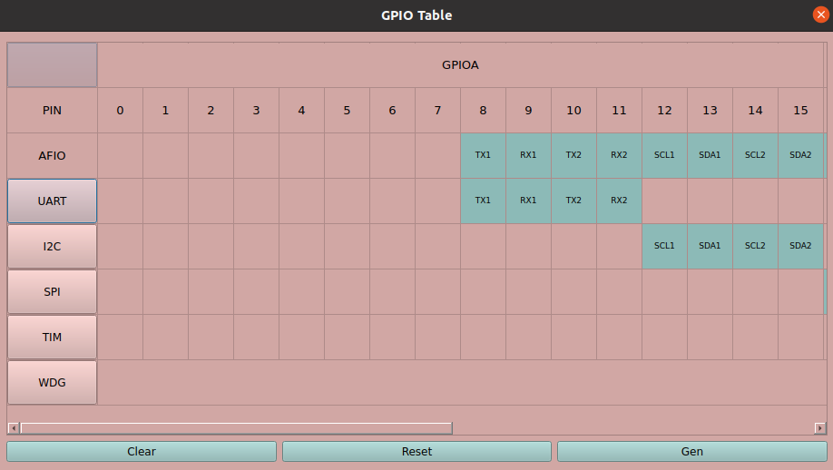
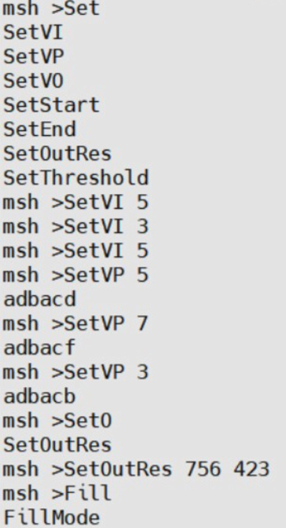
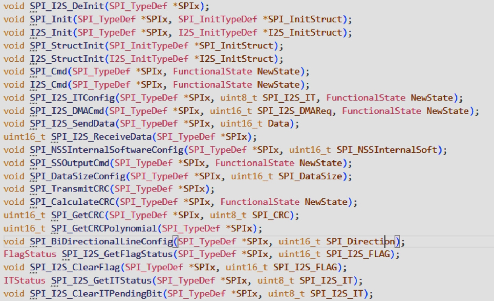
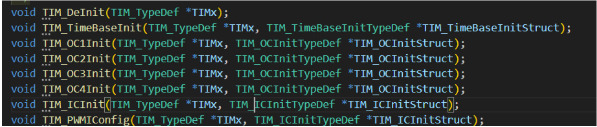

**English | [简体中文](README_cn.md)**
<div id="top"></div>

[![Contributors][contributors-shield]][contributors-url]
[![Forks][forks-shield]][forks-url]
[![Stargazers][stars-shield]][stars-url]
[![Issues][issues-shield]][issues-url]
[![License][license-shield]][license-url]


<!-- PROJECT LOGO -->
<br />
<div align="center">
    <a href="https://github.com/MoonGrt/Riscv-SoC-Software">
    
    </a>
<h3 align="center">Riscv-SoC-Software</h3>
    <p align="center">
    project_description
    <br />
    <a href="https://github.com/MoonGrt/Riscv-SoC-Software"><strong>Explore the docs »</strong></a>
    <br />
    <a href="https://github.com/MoonGrt/Riscv-SoC-Software">View Demo</a>
    ·
    <a href="https://github.com/MoonGrt/Riscv-SoC-Software/issues">Report Bug</a>
    ·
    <a href="https://github.com/MoonGrt/Riscv-SoC-Software/issues">Request Feature</a>
    </p>
</div>


<!-- CONTENTS -->
<details open>
  <summary>Contents</summary>
  <ol>
    <li><a href="#file-tree">File Tree</a></li>
    <li>
      <a href="#about-the-project">About The Project</a>
      <ul>
      </ul>
    </li>
    <li><a href="#contributing">Contributing</a></li>
    <li><a href="#license">License</a></li>
    <li><a href="#contact">Contact</a></li>
    <li><a href="#acknowledgments">Acknowledgments</a></li>
  </ol>
</details>


<!-- FILE TREE -->
## File Tree

```
└─ Project
  ├─ .gitignore
  ├─ README.md
  ├─ /projects/
  │ ├─ /freertos/
  │ ├─ /rt-thread/
  │ ├─ /bare/
  │ └─ /pika-python/
  ├─ /.vscode/
  ├─ /GUI/
  │ ├─ DVPConf.py
  │ ├─ Sim_test.py
  │ ├─ IDE.py
  │ ├─ GPIOConf.py
  │ ├─ NewPro.py
  │ ├─ RISCVSimulator.py
  │ └─ /RISCVSim/
  ├─ /Document/
  │ └─ Cyber.scala
  ├─ /scripts/
  │ ├─ openocd
  │ ├─ cyber.yaml
  │ └─ cyber.cfg
  └─ /Workspace/
    ├─ /demo/
    │ ├─ Makefile
    │ ├─ link.lds
    │ ├─ Cyber.v
    │ ├─ /libs/
    │ │ ├─ cyber.h
    │ │ ├─ gpio.c
    │ │ ├─ gpio.h
    │ │ ├─ tim.c
    │ │ └─ tim.h
    │ ├─ /rt-thread/
    │ │ ├─ /components/
    │ │ │ ├─ /finsh/
    │ │ │ └─ /dfs/
    │ │ │   ├─ dfs.c
    │ │ │   └─ dfs.h
    │ │ ├─ /include/
    │ │ │ ├─ rtdef.h
    │ │ │ ├─ rthw.h
    │ │ │ ├─ rtservice.h
    │ │ │ ├─ rtthread.h
    │ │ │ └─ types.h
    │ │ ├─ /libcpu/
    │ │ │ ├─ context_gcc.S
    │ │ │ ├─ stack.c
    │ │ │ ├─ trap.c
    │ │ │ └─ trap_entry.S
    │ │ └─ /src/
    │ ├─ /user/
    │ │ ├─ main.c
    │ │ ├─ rtconfig.h
    │ │ └─ start.S
    │ └─ /build/
    └─ /test/

```


<!-- ABOUT THE PROJECT -->
## About The Project

Project hardware part: [Riscv-SoC](https://github.com/MoonGrt/Riscv-SoC)  
Project software part: [Riscv-SoC-Software](https://github.com/MoonGrt/Riscv-SoC-Software)  

### Part I Design Overview

#### 1. Design Purpose

Based on the Tang Mega 138K Pro Dock development board, the 'RISC-V Core' is a full-featured RISC-V processing system. The core adopts the open source VexRiscV CPU, supporting RV32IM instruction set and hardware and software interrupts. The system integrates GPIO, UART, I2C, timer and other peripheral modules, and extends the hardware structure of the video channel to form a complete video processing platform. The video channel supports camera as well as HDMI access, and transfers the videoton to DDR storage via DMA, and finally outputs it via HDMI. The system provides image acceleration hardware to support video processing algorithms such as edge detection filtering, scaling, etc. Users can control the functions of each module through programming to achieve complex video processing operations.

#### 2. Application Fields

This project has a wide range of application prospects, covering fields such as security monitoring, automatic driving, medical imaging, retail analysis, sports broadcasting, video editing and augmented reality. In security monitoring, edge detection technology is used to identify moving objects and contours in the video to assist in detecting abnormal behaviours, while video zoom-in and zoom-out technology can adjust the scale of the screen according to the needs of the scene. In autonomous driving and intelligent transport, edge detection helps extract key features of roads and pedestrians to improve system recognition accuracy. In medical image analysis, the technology helps doctors identify lesion boundaries, and video zoom-in facilitates surgical observation. Other applications include retail footfall analysis, event key playback and smart home security recognition.

#### 3. Key Technical Features

**(1) Modular RISC-V processor architecture**: supports RV32IM instruction set with hardware and software interrupt management: provides a good foundation for multi-tasking and real-time response, suitable for embedded devices and real-time applications.

**(2) Efficient Video Processing Link**: Integrated hardware-accelerated image processing capability to quickly perform operations such as edge detection, scaling and filtering, and support for HDMI input and DMA transmission to enhance video data processing efficiency.

**(3) RTOS compatibility**: Supports RT-Thread and FreeRTOS operating systems with bare-metal development, providing efficient task management and real-time response capabilities to meet the needs of latency-sensitive applications. The supporting SDK facilitates rapid development and application deployment.

**(4) Arbitrary Zoom**: Video zoom can be scaled by arbitrary multiples, either expanding any size to full screen or reducing the full screen to any resolution, leaving a series of interfaces for users to configure.

**(5) Based on the software and hardware co-optimisation of custom development capabilities**: This system allows users to flexibly configure the GPIO module through the supporting graphical IDE developed by the team to expand the input and output interfaces of the RISC-V processor. Users are not only able to regulate the peripheral control logic of the system, but also extend the hardware functions on the FPGA through customised Hardware Description Language (HDL) code to achieve algorithm acceleration or edge computing functions for specific industry needs.

#### 4. Key Performance Indicators

#### 4.1 Processor Performance

**Principal frequency**: the operating frequency of the processor, which directly affects the system computing speed and processing capability; Power consumption: the power consumption performance under different loads, which is particularly important in embedded applications.
**Video frame rate**: the frame rate of the system processing video after hardware acceleration, which directly affects the real-time and display stability of video streaming;
**Image quality evaluation**: Peak Signal Ratio (PSNR) and Structural Similarity (SSIM) are selected as parameters for quantitative evaluation.

#### 4.2 System scalability:

**GPIO configurability**: the degree of flexibility and configurability of the GPIO interface enables the system to adapt to different peripherals and application requirements;
**I/O support type and number**: the richness of interface type and number (e.g., UART, I2C, SPI, etc.) enhances the compatibility of the system with diverse hardware.

#### 4.3 Development tools and ease of use:

**IDE functional integrity**: whether the development environment integrates complete debugging, configuration and simulation functions, and whether it is easy for users to get started quickly.
**RTOS compatibility**: stability and multitasking management efficiency when running on this operating system.

#### 5. Main Innovations

**(1) Development of supporting IDE**: For the team's self-developed 'Raycom' CPU, the team has designed and implemented a supporting integrated development environment (IDE). The IDE is equipped with a simple and intuitive graphical user interface (GUI), so that users can easily get started without complex programming. At the same time, the team embedded rich debugging and configuration functions in the IDE to support code editing, compilation, simulation and debugging, which greatly simplifies the development process of users on the 'CoreVision' platform, and improves the development efficiency and ease of operation.

**(2) Configurable GPIO Expansion**: In order to enhance the adaptability and flexibility of the CPU, the team has designed a configurable GPIO module, which enables users to customise different peripherals and control schemes according to their needs. By maximising the open GPIO configuration, users can flexibly expand the CPU functions to adapt to diverse application scenarios, such as edge computing and IoT device control. This design makes the system more compatible and expandable, and meets the individual needs of different industries and applications.

**(3) Software system support**: The project's 'CoreVision' CPU fully supports RT-Thread and FreeRTOS operating systems and bare-metal development, and integrates the corresponding SDK (Software Development Kit). RT-Thread, as a lightweight real-time operating system, is widely used in embedded devices. With the support of this system, we can make full use of the advantages of 'CoreVision' in terms of real-time response and task scheduling; BareMetal has no operating system scheduling and has a very fast response speed, which is suitable for controlling simple tasks such as subsequent user access to sensors; FreeRTOS supports real-time scheduling, which is suitable for the requirement of fast response. real-time scheduling and is suitable for applications requiring fast response. Each operating system is equipped with routines for users to use or refer to the development of the SDK supporting the provision of a rich API interface, easy for developers to quickly get started, shorten the development cycle, to achieve efficient software development and application deployment.

**(4) Hardware Acceleration of Video Processing Algorithms**: For the needs of video processing, especially in the application scenarios of edge detection, image filtering, etc., this project optimises the convolutional operation through hardware acceleration. The use of hardware convolutional acceleration greatly improves the efficiency of image processing, so that the 'Ruixin Core' CPU has higher performance and processing speed in video processing, which is suitable for real-time video analysis, intelligent monitoring and other high computing demand scenarios. The introduction of hardware acceleration significantly reduces the CPU load, optimises system power consumption and response performance, and provides strong support for the wide application of edge computing [1].

**(5) Data Cache Optimisation and Latency Control**: We optimise the data cache and latency control method for the needs of 'RuiViCore' CPU in image interpolation computation. In the implementation of the interpolation algorithm, the pixel values around the interpolation point need to be stored and called frequently, so we introduced a FIFO (first-in-first-out) buffer with RAM as the element as the storage scheme, instead of the traditional row buffer and ping-pong rotation mechanism. Compared with the row buffer scheme, the RAM FIFO buffer can effectively reduce the latency; compared with the ping-pong rotation mechanism, the RAM FIFO buffer significantly reduces the hardware resource consumption [2]. In addition, the sequential storage of the FIFO buffer ensures the efficient reading and writing of data, which provides a guarantee for the real-time and accuracy of the interpolation algorithm, and helps to improve the response speed and system performance of image processing.

### Part II System Composition and Function Description

#### 1. Overall Introduction

Our 'RISC-V' RISC-V processing system is shown in Fig. 1 and Fig. 2 (the block diagram of the system and the RTL diagram exported by Gowin IDE, respectively):

<p align="center">
    
    Figure 1. Block diagram of the 'CoreVision' system.
</p>

<p align="center">
    
    Figure 2: RTL diagram of the 'CoreVision' system project (exported by Gowin IDE).
</p>

#### System Architecture

The system consists of two major components, hardware and software, working in tandem to provide a comprehensive video processing solution. The hardware part includes a processor based on RISC-V architecture and a specially designed video processing path, while the software part includes an integrated development environment (iDE) and supporting libraries (libs, Makefile, linker).

##### hardware part:

The system is based on the Gowin TangMega138KProFPGA development platform, which integrates various hardware modules required for video processing. The corresponding hardware description files (.V) are generated by configuring GPIOs. These files are synthesised and laid out and wired in the Gowan IDE, and finally bitstream files (.fs) are generated through the programmer and burned into the PGA on the Windows side to achieve dynamic configuration and update of the hardware.

##### Software part:

The software development environment is located in an Ubuntu virtual machine, and users can operate in an IDE developed by the team in-house. The IDE allows the user to intuitively configure the GPIOs and generate the corresponding library files (libs), select the desired software model, and compile the corresponding source code (.c, .h) and makefile, and then load the generated software into the RISC-V processor using the openocd and GDB toolchains. The real-time operating system (RTOS) runs in a Windows environment and communicates data and transfers commands to the development board through a serial port (UART).

##### video processing functions:

As a complete video processing system, a variety of algorithms have been integrated including video tilt cropping, arbitrary magnification video streaming scaling, edge detection, image binarisation, colour format conversion, image complementation and filtering, etc. It is capable of processing input video frames from HDMI or camera and storing the results into the on-board DDR. Users can not only run the verified video processing algorithms in the real-time operating system, but also execute customised programs on the CPU via IDE to meet the specific requirements of different application scenarios.

#### 2. Introduction of each module

#### 2.1 System software:
##### 2.1.1 VexRiscV CPU

<p align="center">
    
    Figure 3. Block diagram of the VexRiscV CPU core.
</p>

The architecture of this system processor design consists of a core CPU module, bus cross switches, peripheral interfaces and control modules.

##### 2.1.2 Processor Core

The processor core is based on the RISC-V architecture and is capable of handling interrupt signals to support real-time control of external devices. The core module implements support for the RV32IM instruction set and supports debugging functions through the JTAG interface. The processor is connected to the peripheral modules through interrupt lines to respond to interrupt requests from different peripherals, thus ensuring real-time system responsiveness. The debugging function is implemented through the JtagCtrI module, which allows the developer to debug the processor's operation status through the JTAG interface.

##### 2.1.3 AXI Bus Cross Switch

**AXICrossbar**: This module enables efficient connections between the CPU and different peripherals. It allows the processor to access multiple peripheral modules via the AXI bus, thus enabling resource sharing and data transfer [3]; the
**AHB and APB bus interfaces**: the system uses the AHB and APB bus standards, with the AHB bus being used for higher performance data transfer requirements and the APB bus being used for lower speed peripheral control interfaces [4].

##### 2.1.4 Peripheral Modules

GPIO: General Purpose Input Output Module is used to control the inputs and outputs of external pin I, providing a flexible hardware interface.
SPI Controller: SPI module is used to communicate with SPI peripherals and support data transfer of SPI protocol.
12C Controller: 12C module is used to communicate with peripherals supporting 12C protocol, such as sensors or other 12C devices.
UART: Serial communication interface for serial data transmission, suitable for communication with serial devices.
Timer (TIM): The timer module supports the triggering of periodic events and is mainly used for timing operations and generating interrupts.
Watchdog (WDT): (Window, Independent) Watchdog module is used to monitor the system operation status and prevent the system from getting out of control.
DMA Controller: The DMA module implements direct memory access control to improve data handling efficiency and reduce the burden on the CPU.
RCC module: Clock and reset control module is used to manage the clock signal and reset control of the system.
DVP module: video processing module, realising the processing system application of RISC-V CPU in specific scenarios.

##### 2.1.5 Video Pathway

<p align="center">
    
    Figure 4. Block diagram of the video processing pathway.
</p>

The video processing path is divided into three parts, video input (VI), video processing (VP) and video output (VO), according to the flow of video streaming data and functions.

##### Video Input (VI)

The Video Input (VI) module is a multi-functional video capture and processing unit designed to acquire image data from a CMOS image sensor or built-in test pattern generator, format it and synchronise the signal output for use by subsequent video processing modules. The core functions of the module include data acquisition and initialisation configuration based on an external CMOS image sensor, test pattern generation and output selection, and format conversion from 8-bit data to 16-bit data The module supports two main input modes: test pattern mode and CMOS data mode. When the mode is set to test pattern, the VI module activates the internal testpattern sub-module to generate pattern data. testpattern module generates preset test patterns (such as coloured stripes, grey scale or grid patterns) according to the configuration and outputs them together with line sync, field sync and data enable signals. The module converts the received testpattern data into RGB565 format for output, and at the same time controls the output of the sync signal, field sync and enable signal to ensure the timing synchronisation of the testpattern; when set to CMOS data mode, the VI module realises the configuration and data metrics set of the CMOS sensor by interfacing with the CMOS image sensor and using the internal CAM submodule. First, the CAM module establishes contact with the CMOS sensor via I2C communication to configure its operating parameters, including resolution and frame rate, to ensure that the output of the image sensor meets the expected specifications. After the configuration is complete, the CAM module receives the pixel data transmitted from the image sensor line by line, driven by the pixel clock of the CMOS sensor. The valid region of the image data is typically marked by the horizontal and vertical reference signals of the CMOS sensor to indicate whether the current data is valid. To accommodate subsequent processing requirements, the CAM module contains an internal data format conversion sub-module that converts the 8-bit data output from the sensor to a 16-bit RGB565 format. This format conversion ensures that the data can be formatted to match the inputs of subsequent modules. The converted 16-bit data is output via the CAM module to the main data interface of the VI module. At the same time, the control signals generated by the CAM module are used to mark the validity and synchronisation of the data, ensuring that the data flow is continuous and synchronised throughout the system. the VI module can be equipped with a Vl Control Register.

<p align="center">
    
    Fig. 5. RTL diagram of the video processing (VP) module (exported by Gowan IDE).
</p>

##### Video Processing (VP)

The video processing module is used to perform a variety of image processing operations on the input video stream data, specifically including cropping, filtering, scaling, colour space conversion, edge detection, binarization and filling, etc. The VP module can dynamically enable or disable these processing functions according to the configuration of the control registers, so as to support diversified video application scenarios.

The VP module receives data from the VI module, processes the data sequentially through multiple function modules, and finally outputs the processed data stream. The following are the main data flow processes within the VP module and the processing steps of the functional modules, all VP Control Register:

1. Input and Signal Conversion
The input video data is accessed to the VP module in 16-bit RGB565 format. The data is first converted to 24-bit RGB format after entering the VP module to meet the processing requirements of subsequent modules. There are video valid signals (de) and vertical sync signals (vs) in the module to ensure the timing and validity of data processing.
2. Cropping
When the cropping function is enabled, the cropping module will crop the input image to the specified area according to the set start (START) and end (END) coordinates, and discard the remaining parts. This function is used to focus the region of interest in the image. The start and end coordinates of the cropping region are set by the configuration register and specified by the user based on UART communication.
3. Filtering
The filter module is used to smooth the image to reduce noise or enhance image details. Supported filter modes include Gaussian filter, mean filter and median filter. The enabling of the filter function and the filter modes are controlled by the user through the serial communication configuration registers. The filtering operation can make the image smoother, thus improving the visual effect.
4. Zoom
The zoom module can zoom in or zoom out on the image, and supports various interpolation algorithms, including neighbour interpolation and bilinear interpolation. The scaling multiplier is set by the resolution register to achieve the specified output resolution. The clock of the module is driven by the input signal and dynamically adjusts the data size according to the image demand
5. Colour space conversion
The colour space conversion module is used to convert the RGB format to greyscale (Y-channel) for subsequent image analysis processing. This conversion reduces data complexity and is suitable for operations such as edge detection and binarisation. This module can be enabled or not by selecting it through the configuration registers to support different conversion modes.
6. Edge Detection
The edge detection module extracts contours and boundaries in an image to highlight the shape of an object. The module supports two edge detection algorithms, Sobel and Prewitt, which are suitable for different detection needs. The country value for edge detection can be configured through the value register to adjust the sensitivity of edge detection [5, 6].
7. Binarisation
The binarisation module converts the image grey scale values into black and white values to simplify the image structure and facilitate further analysis. Binarisation supports forward and inverse modes, which are selected by the configuration register. The value register is used to set the discriminating criteria for binarisation to control the luminance division.
8. Filling
The Fill module is used to fill the image edges when the resolution of the scaled image is less than the output resolution. The colour of the fill can be selected from black, white or a custom colour. The fill function is enabled by configuring registers for scenarios with high image display requirements.

##### Video Output (VO)

The Video Output module (VO module) is used to output video data to the HDMI interface. It is responsible for generating the timing and differential signals required by HDMI from the incoming video data and ensuring that the video data is output to the display at the correct time and location.The VO module consists of three main parts: input processing, timing generation and HDMI transmission.The VO module receives 16-bit video data from the incoming VP module. When the signal is valid, it maps the input data to complete 24-bit RGB data and generates the output display clock. The processing includes parsing out each bit of the red, green and blue tri-colour signals from the input signal and splicing them in the format required for HDMI display. After processing by the timing generation module, the generated timing signal and the processed RGB data are input to the DVI/HDMI transmission module. This module generates the TMDS signal (Transmission Minimum Differential Signal) required by HDMI through differential transmission, including clock signals and TMDS data signals. This system supports LCD, HDMI and other video output methods for users to choose from, through the VOControlRegister.

#### 2.2 System Software:

Ubuntu side (IDE), Windows side (UART)

<p align="center">
    
    Figure 6. Ubuntu side (IDE), Windows side (UART).
</p>

The software design scheme of this system covers the embedded system development process, including code compilation, hardware configuration, interaction with FPGA, and debugging and other modules.

##### 2.2.1 Development Environment and Software Architecture

**Operating system and IDE**: the development environment is based on the Ubuntu system, which integrates an IDE (Integrated Development Environment) to manage and edit the code. the IDE allows the user to select the sample programme, edit the software code, and generate the hardware code module, etc., in the same interface.

**Software Architecture**:
1. Demo_Choose: This module is used to select the sample code to be executed. Users can select different sample programs for different functional tests and verification.
2. Software: This module contains the main business logic code main and the underlying interface (e.g. RTOS real-time operating system function calls). All programme logic and control flow are implemented in this module.
3. Hardware: contains hardware-related code files, such as GPlO (General Purpose Input Output Interface) configuration module and hardware description file (Verilog). These modules encapsulate specific hardware behaviours into software-callable interfaces.
4. code extension: in addition to the above modules, but also includes libs library files and link files. Library files (e.g. .h header files, .c source files and .S assembly files) contain function definitions and hardware abstraction interfaces, while linker files are used to properly link individual modules into executable programmes.

##### 2.2.2 Code Compilation and Build Flow

**Makeflle**: The build process is managed by the Makefile file, which defines the compilation flow and dependencies. When executing the build command, Makefile compiles the source files of each module in turn and links the generated target files into executable firmware files.
**Linking and Address Allocation**: After compilation, the linking file ensures that the code and data of each module are correctly placed at the specified memory addresses. In this way, the generated executable file can be loaded directly into the FPGA's DDR memory.

##### 2.2.3 Download and debugging tools

**OpenOCD**: Use the OpenOCD (Open On-Chip Debugger) tool to download the compiled and generated program to the FPGA DDR.
**GDB debugging**: GDB (GNU debugger) is used in conjunction with OpenOCD for program debugging. Developers can use GDB to set breakpoints, view memory, monitor register status, etc., so as to monitor and debug the programme in real time.
**UART DOWNLOAD**: burn boot firmware in bare metal development.

##### 2.2.4 Serial Communication with FPGAs

**Serial communication**: Serial communication with FPGA through UART (Universal Asynchronous Transceiver Transmitter) in Windows system. The serial communication module transmits the output data of FPGA to PC, which is convenient for developers to observe the operation status and output results of FPGA in real time.
**Tool Chain**: Gowin provides FPGA development tool chain with download and configuration support. Through Gowin, developers can download firmware files in .SVf format to FPGAs for system configuration and function verification.

##### 2.2.5 Functional and Process Overview

The workflow of the system starts with selecting the sample programme and completing the code writing in Ubuntu via IDE, then compiling and linking to generate the executable file using Makefile. After the program is downloaded to the FPGA, the program is debugged through GDB or interacts with the FPGA through UART, while the Windows side is mainly responsible for monitoring the serial port for debugging and result observation.

### Part III Completion and Performance Parameters

#### 3.1 IDE

The IDE page (shown in Figure 7) developed by our team is simple and clear, and supports a variety of integrated development functions.

<p align="center">
    
    Figure 7. IDE page.
</p>

**(1) Project Management**: Users can create, open and manage multiple project files in the IDE to make the development process more efficient. In order to enhance the comfort of use and smooth operation, when the user selects a target file, the system will automatically import the directory where the file is located into the file resource management bar on the left side of the IDE page, which makes it easy for the user to quickly switch and access the file in one window. The file resource management bar supports hierarchical display and directory tree operation, in which users can directly view, edit and manage items from the file structure. In addition, through the buttons on the top of the resource management bar, users can easily rename, delete, copy and other operations, thus further improving the convenience and operational efficiency of project management (as shown in Figure 8).

<p align="center">
    
    Figure 8. Resource management column.
</p>

**(2) Project Configuration**: support for users to create new projects in the IDE (as shown in Figure 9), can be compatible with multiple types of core users can follow their own needs for AHB or APB enablement, if there is no specified core, tick Cyber ', you can generate the team produced lightweight core Cyber.h.

After the selection is complete, you can configure the GPIO autonomy on the visualisation page (as shown in Figure 10). This configuration page supports serial port addition, pin selection, initial pin invalidation, and automatic error reporting. When the configuration is complete and the Generate button is clicked, the top-level Cyber.v file is automatically generated.

<p align="center">
    
    Figure 9. New Project Window.
</p>

<p align="center">
    
    Figure 10. GPIO Autoconfiguration Window.
</p>

<p align="center">
    
    Figure 11. Generating the .v hardware file.
</p>

**(3) Software Compilation**: After the user selects or creates a code file, the file will be displayed in the central editing window of the IDE's file page (as shown in Figure 12). Users can write and modify the code in this central window and enjoy a convenient editing experience. After writing, users can click the 'Compile', 'Run' and 'Modify' buttons at the top of the page, and the background will execute the corresponding workflow according to the selected operation.

If the user selects 'Compile', the system will automatically compile the current code and display the compiled assembly code and machine code in the 'AssembleCode' and 'MachineCode' areas on the right side of the page in real time (as shown in Figure 12). MachineCode' areas (shown in Figure 12) display the compiled assembly code and machine code in real time. These areas provide an intuitive display of assembly language and machine code, making it easy for users to analyse and optimise code performance. Through this intuitive compilation feedback, users can quickly detect and correct errors in the code and optimise the code logic, thus significantly improving development efficiency.

<p align="center">
    
    Figure 12. Compile the file to generate assembly and machine code.
</p>

<p align="center">
    
    Figure 13. Stepping assembly code for simulation.
</p>

<p align="center">
    
    Figure 14. Message Panel.
</p>

**Real-time operating system and corresponding video path algorithms**

The complete video processing pathway algorithm developed by our team has successfully downloaded the executable file (.elf file) to the on-board DDR memory via the GDB tool. When the user logs into the system, he/she can choose either bare-metal upload or any real-time operating system (RT-Thread Free RTOS, RT-Thread is recommended,) to input commands and run the programme. In the user login screen (shown in Figure 15), the system requires the user to enter a password to secure access. After successfully logging in, the user can use the 'list' command (similar to the commonly used 'help' command) to view the list of programs available for execution, and the 'list-thread' command to view all the threads currently running on the CPU to enhance the user-friendliness of the system. To enhance the user-friendliness of the system, a number of interactive features have been integrated into the system. For example, during the login process, if the user enters the wrong password, the system will remind the user to re-enter it in time. In addition, the system supports the auto-completion function of commands, which allows the user to press the 'Tab' key to complete some of the letters in the commands, thus improving the operation efficiency. These features are designed to optimise the user's operating experience and ensure that the user can control and execute the required procedures efficiently and conveniently in the real-time system.

<p align="center">
    
    Figure 15. Logging in to the real-time operating system to view demos and threads.
</p>


Take the OV5640 camera as the video input source as an example, configure it as 1280*720 video frame input to FPGA, set the video shrinking mode through the instruction shown in Figure 16, and use 'SetOutRes756423' to shrink the 1280*720 video frame to 756*423, and fill the remaining part of the screen with black through the 'Fl' instruction, to prevent the execution of the shrinking instruction. The cached image of the previous frame is presented on the screen at the same time with the reduced image of the real-time display video frame.

<p align="center">
    
    Figure 16. Video Reduce and Fill Blanks command.
</p>

command to set the video zoom mode, using 'SetOutReS1280720' to set the output image pixels to 1280*720, zoom area through the 'SetStart12364' and 'SetEnd802400' to determine the start and end point of the area coordinates of (123, 64), (802, 400).
SetStart12364' and “SetEnd802400” to determine the start point and end point coordinates of the region (123, 64), (802, 400).

The video zoom in and zoom out is shown in Figure 17, with a team member standing with a tablet in his hand at the same distance and angle from the camera in three situations: the original image, the zoomed-in image, and the zoomed-in image. As shown in the figure, the video zoom in and zoom out can be processed in real time with high definition and low latency.

<p align="center">
    
    Figure. 17. Video captured in three cases.
</p>

#### 3.2 CPU part of the simulation waveforms

The project completes a variety of custom peripherals: timer, GPIO, SPI, UART, interrupt, and watchdog. Table 1 shows the APB bus signal name definitions and descriptions:

<div align="center">

Table 1. APB bus emulation waveform signal name definition and description.

| **APB Bus Signal Names** | **Signal Definitions and Functional Descriptions** |
|-----------------------|-------------------------------------------|
| io_apb_PCLK | APB bus clock signal |
| io_apb_PRESET | APB bus reset signal that resets the module when low |
| io_apb_PADDR | APB address bus, register for GPIO selection | 
| io_apb_PSEL | APB select signal to select GPIO module | 
| io_apb_PENABLE | APB enable signal, when high indicates a valid transfer | 
| io_apb_PWRITE | APB Write enable signal, high for write operation, low for read operation | 
| io_apb_PWDATA | APB Data bus, used for writing data |
| io_apb_PRDATA | APB data bus for read data | 

</div>

<div align="center">

Table 2. GPIO Configuration Register Name Descriptions.

| **GPIO Configuration Registers** | **Signal Definitions and Functional Description** |
|:---------------------:|:---------------------:|
| CRL and CRH | IO Configuration Registers |
| BSRR | IO Set/Reset Register |
| IDR | GPIO Input Data Register |
| ODR | GPIO Output Data Register |

</div>

The GPIO configuration and push-pull and open-drain output waveforms are shown in the following figure.CRL and CRH are used to configure the push-pull outputs, open-drain outputs, and input modes of the GPIO pins II, etc. The configuration waveforms in the figure show the configuration of CRL and CRH through PADDR and PWDATA.IDO and ODR are used to read and write the status of the GPIO pins I and II, respectively. In push-pull mode, after configuring GPIO pin I to push-pull mode, the value of ODR register directly controls the output level, which can be used to drive high and low levels; in open-drain mode, after configuring GPIO pin I to open-drain mode, ODR outputs a low level when it writes 'O', and the pin is suspended when it writes '1' (high-resistance state). This mode is suitable for bus communication circuits.

<p align="center">
    
    Figure 18. GPIO section function prototypes.
</p>

<p align="center">
    
    Figure 19. GPIO configuration, push-pull open-drain output simulation waveforms.
</p>

The UART configuration, transmit-receive interrupt waveform is shown in the figure below.In the UART configuration stage, the baud rate of the UART is set through the BRR register to control the data transmission speed. As shown in the figure, the data in PWDATA in the waveform is written to the BRR address, and the baud rate of UART is configured successfully in this process. Configure the operating mode of the UART and enable the transmit and receive interrupts through the CR1 and CR2 registers. By setting the corresponding bit in CR1, the UART can be configured to trigger an interrupt signal when data is received or when transmission is complete. During the data transmission and reception phases, data is written to the TX register. Each time data is written, the UART module sends the data via the UART TX signal. A change in the waveform of the UART TX signal can be observed in the waveform, indicating that the data is being sent bit by bit.The UART receives data on UART RX, and the data enters the UART's receive buffer bit by bit. When a full byte of data is received, it is placed in the RX register. The 'UART interrupt handler' marked in the waveform indicates that after the interrupt is triggered, the CPU enters the interrupt service routine (ISR), which reads the flag bits in the SR to determine whether the transmission is complete or the reception is complete, and then handles the situation accordingly (e.g., reading the received data or preparing to send new data). The actual simulated waveforms conform to the expected design.

<p align="center">
    
    Figure 20. Prototype of the UART part of the function.
</p>

<p align="center">
    
    Figure 21. UART Configuration, Send-Receive Interrupt Waveforms.
</p>

The SPI configuration, output waveforms are shown below. During the SPI configuration phase, the parameters for SPI communication are configured by writing values to the CR1 and CR2 registers via the APB bus. Configuration register operations are done through the PADDR address core PWDATA data bus, PWRITE is high to indicate a write operation, and PSEL and PENABLE work together to control the validity of data transmission. When sending data (MOSI), the master device writes data to the DR register when it wants to send data. Multiple data write operations can be seen in the waveform on PWDATA, and these data are transferred to the MOSI signal line. When receiving data (MISO), the MISO signal line is used to receive the data returned from the device and store it in the DR register. The data received by MISO can be read through PRDATA. At the start of communication, the master device pulls the CS signal low to select the corresponding slave device. When CS goes low, SPI data transmission is valid, and CS returns high to end the transmission. When the transmission is complete, the SPI module can trigger an interrupt to notify the CPU for subsequent processing, with the corresponding flag bit set by the SR signal. The waveforms show how the APB bus configures the SPI module through registers and how the signals of SCK, MOSI, MISO and CS change during the SPI data transfer. This configuration and transmission process is a typical SPI communication protocol flow and is consistent with the expected results.

<p align="center">
    
    Figure 22. SPI Port API Function Prototype.
</p>

<p align="center">
    
    Figure 23. SPI configuration, output waveforms.
</p>

<div align="center">

Table 3. Timer Configuration Register Name Descriptions.

| **TIM Register Name** | **Signal Definition and Function Description** |
|---------------------|-----------------------|
| CR1 | Timer Control Register 1, used to enable the timer, set the timer operating mode, counting direction, etc |
| CR2 | Timer Control Register 2, usually contains additional function configuration options such as output control, etc |
| DIER | Disconnect Enable Register 1, used to enable the timer, set the timer operating mode, count direction, etc
| SR | Register, usually contains additional function configuration options such as output control, etc. |
| EGR | File Generation Register for generating update events (e.g., reloading counter values) |
| CCMR1 CCMR2 | Compare Mode Register, configure the output compare mode or input capture mode, here used for PWM output mode configuration |
| CCR | Get/Compare Register, controls the duty cycle of the PWM signal, i.e., signal high duration |
| PSC | Crossover Register, used to set the clock crossover coefficient of the timer and control the timer counting speed | 
| ARR | Reload Register, used to set the period of the timer. The counter will reload and trigger an update event when it reaches the ARR value |

</div>

The timer configuration and PWM output waveforms are shown below. In the timer configuration stage, the timer is enabled through the CR1 control register, and the timer starts counting. the relevant bits in CR1 set the operation mode of the timer (e.g. counting up or counting down), and control whether the timer will start immediately. In the PWM waveform configuration, the value of CCMR1 or CCMR2 determines the mode of the PWM signal, e.g., edge-aligned mode or centre-aligned mode, and implements the frequency and duty cycle control of the PWM signal. the CR capture/comparison register, with the incoming value, defines the duration of the high level of the PWM signal, and the value of the duty cycle determines the ratio of high and low levels of the signal. For example, setting the CCR value to 50 results in a PWM signal that is high for half a cycle. The waveform diagram shows how the timer is configured and generates the PWM signal through the PWM output mode, focusing mainly on the period setting and duty cycle adjustment of the timer. By configuring the CCMR and CCR registers, the output characteristics of the PWM signal can be flexibly controlled, and the waveform is as expected

<p align="center">
    
    Figure 24. Timer Port API Function Prototype.
</p>

<p align="center">
    
    Figure 25. Timer configuration, PWM output waveforms.
</p>

The timer configuration, timing interrupt waveform is shown below. An interrupt signal is generated when the timer reaches the auto-reload value and triggers an update event. This signal is used to notify the CPU to process the timer interrupt service routine (ISR). The timer configuration phase performs the enable and mode settings and prescales and reloads the value.The timer clock division value and automatic reload value are set by writing to the PSC and ARR registers. The timer update interrupt is enabled by setting the appropriate bit in the DIER register. The timer starts counting from ○ and gradually increases according to the preset division factor. When the count value reaches the ARR setting, the counter resets and an update event is generated. The update event triggers an interrupt when the timer's counter reaches the ARR value and is reloaded. The waveform shows that the TIM interrupt signal is pulled high at a specific moment, indicating that the interrupt has been triggered. After the interrupt is triggered, the CPU enters the interrupt service routine (ISR) to process the timer overflow event. From the waveform, it can be seen that the timer interrupt signal is repeatedly triggered at fixed intervals to form a periodic interrupt, which is in accordance with the design.

<p align="center">
    
    Figure 26. Timer Configuration, Timed Interrupt Waveforms.
</p>

The Independent Watchdog (IWDG) Configuration, Watchdog Reset output waveform is shown in the following figure.MDG Configuration Phase, the waveform can be seen that PADDR selects the address of the PR register and PWDATA writes the prescaler value. For example, 12h01e indicates that a specific value is written to configure the prescaler parameter of the IWDG to change the decrement rate of the counter. At another point in time, PADDR points to the RLR register address and a reload value is written in PWDATA (e.g., 32h00000073), which indicates that a reset operation will be triggered when the counter decrements from this value to zero. In the feed dog operation (KR register write), you can see that PADDR selects the KR register address and a specific feed dog value is written in PWDATA. This will reset the counter to the reload value in the RLR register, preventing the watchdog from triggering a reset.The PR and RLR registers are used to set the counter's prescaler and reload values, respectively, and to control the counter's countdown interval and reset time. The basic functionality of the WDR module is verified by this waveform including counter countdown, dog feed operation and register configuration taking effect.

<p align="center">
    
    Figure 27. Independent Watchdog Port API Function Prototype.
</p>

<p align="center">
    
    Figure 28. IWDG configuration, watchdog reset output waveforms.
</p>

The window watchdog (WWDG) configuration, watchdog reset output waveform is shown below. In the configuration phase, the CFR register address is selected through PADDR, into a specific prescaler value and window value to set the time window of the counter. The window value determines the timing of feeding the dog, if the dog is fed too early or too late it will result in a reset. For example, 8c0 and 7h40 indicate the upper and lower limits of the setup window, and a dog feed operation is only valid if performed within that window. The waveform diagrams illustrate the configuration process including setting the window and prescaler factor as well as performing the dog feeding operation within the window period as expected [7, 8].

<p align="center">
    
    Figure 29. Window Watchdog Port API Function Prototype.
</p>

<p align="center">
    
    Figure 30. WWDG configuration, watchdog reset output waveforms.
</p>

#### 3.3 Video Path Simulation Waveforms

The video path hardware implementation simulation results are simulated using the coloured stripes generated by testpattern.v in the routine. The stripe pattern consists of 8 colours, the width of each colour is 1/8 of the horizontal resolution, the colours are white, yellow, cyan, green, magenta, red, black and blue and these colours are displayed horizontally to form the stripe. Zoom part of the team has developed bilinear interpolation and neighbourhood domain algorithms for users to use, the simulation results here are using bilinear interpolation algorithms that have been verified to be more effective.

**Zoom**: This is set to cut out the middle 172 parts of each frame of the video stream, and zoom the cut out image to double the original. A 1280*720 pixel colour bar is used here for simulation. When prede is high, it means that the pixel input data at the current moment is valid image data in the format of 24-bit wide RGB888 signal. cutter is the module responsible for image cutting. After the input image passes through the cutter module, the output is the cut data (i.e., the image data of the selected region), which is then sent to the next level of the filter module for smoothing or edge processing of the image data. When zooming in, interpolation generates new pixels between the original pixels, so the postdata will contain values for intermediate colours rather than simply repeating them. For example, between the colours 24h3e003e and 24hba00ba, interpolation may generate intermediate values with a gradual transition; post_de will go high more frequently, meaning that more valid data is seen to be output because interpolation generates more intermediate pixels. The simulation results show that the image is enlarged and the simulation is ideal and correct.

<p align="center">
    
    Figure 31. Original image zoomed to two times (bilinear interpolation algorithm) waveforms.
</p>

**SIZE DOWN**: The 1280*720 image captured and incoming from the camera is scaled down to 1/2 pixel size of the original and placed in the top left position of the screen for display. A 1280*720 pixel colour bar is used here for simulation. Similar to the amplification of most data streams, it goes through the cutter and filter modules and then enters the scaler for reduction. During the reduction, the bilinear interpolation performs a weighted average of multiple pixels of the original image so that more details can be retained in the reduced image. Similarly, the data in post_data will be a mixture of multiple pixels. Due to the reduced output data, the high levels of post_data are relatively sparse. The waveform simulation shows that the image is reduced and the results are as expected and correct.

<p align="center">
    
    Figure 32. The original image is reduced to 1/2(Bilinear interpolation algorithm) waveform.
</p>

**Image binarization**: Convert the RGB565 image input from the camera into a black and white image output. The data after binarization is usually 1-bit data, and each pixel has only 0 or 1 states. 0 is usually black and 1 is white. Therefore, a high level means that the pixel is judged to be white, while a low level means that the pixel is judged to be black. By watching the postbit change, you can see which pixels are judged to be black or white, forming a black and white image.

<p align="center">
    
    Figure 33. Image binarization waveform.
</p>

**Edge detection**: Identify the outline of the object in the RGB565 image input by the camera, outline the edge part with white, and fill the rest with black to highlight the outline. Observe changes in the edge/post_bit signal and view the image after edge detection processing. The high and low levels of the postbit signal can determine which pixels belong to the edge and which pixels belong to the background. When the post_bit signal is high (1), it means that the pixel is detected as an edge and should be displayed in white. These high level pulses are distributed at short intervals in the postbit, indicating the edge profile of the detected image. When the post_bit signal is low (o), it means that the pixel belongs to the background and should be displayed in black. Most of the post_bit remains low, indicating that the background area of the image has not changed significantly. It can be seen from the simulation results that post_bit is pulled up 8 times in each frame of image simulation, corresponding to the color change gap between the eight color blocks of the color bar and the edge, and the simulation results are in line with expectations.

<p align="center">
    
    Figure 34. Edge detection waveform (sobel operator).
</p>

#### 3.3 Resource Consumption

<p align="center">
    
    Figure 35. Rexcore system resource consumption.
</p>

The system resource consumption is shown in Figure 31, which mainly includes Register, lookup table (LUT), arithmetic logic unit (ALU), block SRAM(BSRAM) and slice SRAM(SSRAM) and other resources. The resource consumption of each module on the FPGA is divided according to the function and shown in a hierarchical structure.

**Overall resource usage**: The project's top-level module "Cyber" consumes a total of 12,617 registers and 23,210 LUTs. These resources are mainly used by functional units composed of sub-modules to realize the core functions of each module.

**Core module Resource usage**:
**VexRiscv**: As a RISC-VCPU core module, VexRisc V, including 923 registers and 1930 LUTs. This indicates that the implementation of CPU core requires more logical resources and storage resources to support complex operations and control functions.
**AhbDVP**: This module is mainly responsible for data processing and transmission, using 8288 registers and 18076 LUTs, and the consumption is high. This is because the module involves more data manipulation and communication logic.
CAM: The submodule CAM under the AhbDVP module also uses relatively more resources, in particular 930 LUTs and 249 registers. This shows that CAM module needs higher logical operation resources when processing data.
** Other modules ** : such as "AhbBridge"," AhbRouter", "Master Arbiter" and other modules have low resource consumption, the function of these modules is relatively simple, mainly responsible for the communication and arbitration between different components in the system, so the demand for resources is less.

#### 3.4 Performance parameters

##### Clock frequency (data for different peripherals, etc.)

For the smallest system (without peripherals), the maximum clock frequency is shown in Figure 32:

<p align="center">
    
    Figure 36. Minimum system maximum clock frequency.
</p>

For a full CPU processing system, the maximum clock rate is shown in Figure 33:

<div style="text-align: center;">


Figure 32. The maximum actual clock frequency can exceed 50MHz of the crystal oscillator frequency of the development board.

</div>

<p align="center">
    
    Figure 37. The maximum actual clock frequency can exceed 50MHz of the crystal oscillator frequency of the development board.
</p>


##### Power consumption analysis:

For the smallest system (without peripherals), the power consumption data is shown in Figure 34:

<p align="center">
    
    Figure 38. Minimum system power consumption.
</p>

For a full CPU processing system, the power consumption data is shown in Figure 35:

<p align="center">
    
    Figure 39. Maximum system power consumption.
</p>

For this team to develop a video processing application function of the "Revision core" work system. From the above data, it can be seen that the power distribution of the system is reasonable, and the dynamic power consumption and static power consumption are effectively controlled. The junction temperature is much lower than the maximum temperature allowed by the system, which indicates that the heat dissipation design meets the system requirements and provides a certain temperature margin, which helps to improve the long-term reliability of the system.

##### Peak signal-to-noise Ratio (PSNR) and Structural Similarity (SSIM)

PSNR is to evaluate the quality of the scaled image based on the difference in pixel values between the image and the output image processed by the algorithm under the same coordinate, usually expressed in decibels (dB). It is a logarithmic expression of the ratio between the maximum possible pixel value and the mean square error (MSE) between two images. The greater the value, the less the image distortion. The expression is:

$$
\text{PSNR} = 10 \cdot \log_{10} \left( \frac{L^2}{\text{MSE}} \right)
$$

其中：

1. MSE (Mean Square Error)：
   $$
   \text{MSE} = \frac{1}{MN} \sum_{i=1}^M \sum_{j=1}^N \left[ X(i,j) - Y(i,j) \right]^2
   $$
   - \(X(i,j)\): Pixel value at position \((i,j)\) in the original image
   - \(Y(i,j)\): Reconstructs or compresses the pixel value at position \((i,j)\) in the image
   - \(M\) & \(N\): The width and height of the image, i.e. the total number of pixels is \(M \times N\)

2. L (Maximum possible pixel value)：
   - \(L\) is the maximum pixel value of the image, and for 8-bit images, usually \(L = 255\).

The higher the value of PSNR, the closer the image quality is to the original image. Under normal circumstances, PSNR above 30dB means that the reconstructed image quality is better.

SSIM is a measure of image similarity by comparing brightness, contrast and structure of images. Different from PSNR, SSIM pays more attention to the structural information of the image and can better capture the perceptual effect of the human eye. The expression is:

$$
\text{SSIM}(x, y) = \frac{(2\mu_x\mu_y + C_1)(2\sigma_{xy} + C_2)}{(\mu_x^2 + \mu_y^2 + C_1)(\sigma_x^2 + \sigma_y^2 + C_2)}
$$

其中：
- \(\mu_x\), \(\mu_y\): The mean (brightness) of the image \(x\) and \(y\).
- \(\sigma_x\), \(\sigma_y\): Standard deviation (contrast) of the image \(x\) and \(y\).
- \(\sigma_{xy}\): Covariance (structural similarity) of the images \(x\) and \(y\).
- \(C_1\) & \(C_2\): Stability constant, used to avoid cases where the denominator is zero, usually defined as:
  $$
  C_1 = (K_1L)^2, \quad C_2 = (K_2L)^2
  $$  \(L\) is the dynamic range of pixel values, \(K_1\) 和 \(K_2\) is a small constant (e.g., \(K_1 = 0.01, K_2 = 0.03\)).

The value of the SSIM is between -1 and 1, usually between 0 and 1, 1 means that the image is identical, 0 means that there is no similarity. A more comprehensive image quality assessment can be obtained by combining PSNR and SSIM [9].

This team uses matlab to write a program to zoom in and out pictures for testing, and verifies the validity of bilinear interpolation and adjacent domain algorithm used in video streaming media scaling hardware algorithm. The program is attached in the appendix. Since the pixel size of the scaled image is different from the original image, it is necessary to compare the scaled image with the original image after up-sampling or down-sampling [2].

The picture of the Tang Mega 138K pro development board based on this project was used for verification demonstration. Due to the problem of reporting space, a smaller resolution image and a smaller magnification were used for demonstration and verification: the generated image was placed in the Algorithm folder.

Through calculation, the PSNR and SSIM indexes obtained by bilinear interpolation and adjacent domain algorithm in scaling up and reducing the above verification are shown in Table 4.

<div align="center">

Table 4. Video streaming scaling algorithm verification and comparison.

| Algorithm | Bilinear interpolation | adjacent field |
| ------------------ | ---------- | -------------- |
| Scaler up | 33.27 dB / 0.8791 | 27.68 dB / 0.8536 |
| Scaler down  | 36.10 dB / 0.9228 | 29.54 dB / 0.8924 |

</div>

The PSNR values and SSIM results shown in Table 4 show that the image quality is higher after scaling, which fully demonstrates the effectiveness of our video streaming media scaling algorithm.

### The fourth part can be extended

##### 4.1 Hardware architecture search and video processing path extension

On-board DDR presets the video streaming media processing algorithm developed by our team, including filtering, scaling and edge detection modules, to form a complete video processing path. Users can flexibly select and combine these hardware algorithm modules to achieve customized video processing flow to meet the needs of specific application scenarios [10]. The "Revision Core" system will provide users with flexible configuration options and support personalized video processing Settings, especially for different surveillance needs, video enhancement processing, real-time image analysis and other scenarios.

##### 4.2 Hardware acceleration support for deep convolutional neural networks (CNNS)

The system provides a convolutional acceleration interface, which allows users to customize and implement multi-layer convolutional neural networks based on hardware platforms, so as to perform complex image processing algorithms, such as YOLO for object recognition, classification and object location [11, 12, 13]. By accelerating convolution operation, the system can efficiently support real-time image processing tasks, making it suitable for target detection requirements in security monitoring, automatic driving, smart home and other scenarios. This architecture extension will enable the system to carry deep neural network reasoning tasks, and enhance the applicability and practical value of "Revision core" in artificial intelligence scenarios.

### Part V References

[1] G.Park, T. Taing and H.Kim,"High-Speed FPGA-to-FPGA Interface for a MultiChip CNN Accelerator,"20232 o th International SoC Design Conference(IsOCC), Jeju,Korea,Republic of,2023,pp.333-334,doi: 10.1109/ISOCC59558.2023.10396076

[2] Wang Yikai. FPGA hardware implementation of real-time video image scaling system [D]. Shanxi: North University of China, 2023

[3] M. Chen, Z. Zhang and H. Ren, "Design and Verification of High Performance Memory Interface Based on AXl Bus,"2021 T EEE 21 st International Conference on Communication Technology(lcCT),Tianjin,China,2021,pp.695-699,doi: 10.1109/1CCT52962.2021.9658046

[4] S. Rangeetha, S. Pandit hur a i, A. Prassath and A. Reegan Cyril Raj, "Design and Implementation of A HB to A PB Bridge and A HB to UART Communication for SoC Integration,"20242 nd World Conference on Communication&Computing (WCONF), RAIPUR, India, 2024,pp. 1-5, doi: 10.1109/WCONF61366.2024.10692006

[5] Song Qiannan, Liu Guangzhu, Wu Lelin, et al. The FPGA system design of image edge detection based on SobeI [J/OL]. Electronic measurement technology, 1-7 [2024-11-10]. http://kns.cnki.net/kcms/detail/, 11.2175. TN. 20240927.1349.091. HTML

[6] Chu W. Research on image edge detection algorithm of railway fasteners based on FPGA [D]. The northern industrial university, 2024. DOl: 10.26926 /, dc nki. Gbfgu. 2024.000708

[7]V. R. Devi and J. Sreedhar,"Design and Implementation of an Improved Watchdog Timer for Memory Applications," 2023 Global Conference on Information Technologies and Communications (GC/TC), Bangalore,India,2023, pp.1-4,doi: 10.1109/GCITC60406.2023.10426468

[8] M. A. Zarrabian, N. Ding and P. Sadeghi, "Asymmetric Local Information Privacy and the Watchdog Mechanism,"2022 T EEE Information Theory Workshop(ITW) Mumbai, India, 2022, pp. 7-12, doi: 10.1109/iTW54588.2022.9965910.

[9] M.Martini,"A Simple Relationship Between S SIM and P SNR forD CT-Based Compressed Images and Video:S SIM as Content-AwarePSNR,"2023 T EEE 25 th International Workshop on Multimedia Signal Processing(MMSP),Poitiers,France. 2023,Pp.1-5, doi: 10.1109/MMSP59012.2023.10337706.

[1o] Yang, Longxing et al.“Searching for Burger Former with Micro-Meso-Macro Space Design."International Conference onMachine Learning(2022)

[11] Hongwu Peng, Shaoyi Huang, Shiyang Chen, Bingbing Li, Tong Geng, Ang Li Weiwen Jiang, Wujie Wen, Jinbo Bi, Hang Liu, and Caiwen Ding. 2022.A length adaptive algorithm-hardware co-design of transformer on FPGA through sparse attention and dynamic pipelining. In Proceedings of the 59th ACM/iEEE Design Automation Conference (DAC '22). Association for Computing Machinery, New York, NY, USA, 1135-1140. https://doi.0rg/10.1145/3489517.3530585

[12] Chen Kai, Chen Xin, Zhang Ying, et al. Evaluation and reinforcement of SEU in Convolutional Neural Network Accelerators [J]. Electronic Devices, 2019,46(02):386-390. (in Chinese)

[13] Cao Xior, Chen Xin, Wei Tongquan. Deep separable Convolutional Neural Network Accelerator based on RISC-V [J]. Chinese Journal of Computers, 2019,47(11):2536-2551. (in Chinese)

<p align="right">(<a href="#top">top</a>)</p>


<!-- CONTRIBUTING -->
## Contributing

Contributions are what make the open source community such an amazing place to learn, inspire, and create. Any contributions you make are **greatly appreciated**.

If you have a suggestion that would make this better, please fork the repo and create a pull request. You can also simply open an issue with the tag "enhancement".
Don't forget to give the project a star! Thanks again!

1. Fork the Project
2. Create your Feature Branch (`git checkout -b feature/AmazingFeature`)
3. Commit your Changes (`git commit -m 'Add some AmazingFeature'`)
4. Push to the Branch (`git push origin feature/AmazingFeature`)
5. Open a Pull Request
<p align="right">(<a href="#top">top</a>)</p>


<!-- LICENSE -->
## License

Distributed under the MIT License. See `LICENSE` for more information.
<p align="right">(<a href="#top">top</a>)</p>


<!-- CONTACT -->
## Contact

MoonGrt - 1561145394@qq.com
Project Link: [MoonGrt/Riscv-SoC-Software](https://github.com/MoonGrt/Riscv-SoC-Software)

<p align="right">(<a href="#top">top</a>)</p>


<!-- ACKNOWLEDGMENTS -->
## Acknowledgments

Use this space to list resources you find helpful and would like to give credit to. I've included a few of my favorites to kick things off!

* [Choose an Open Source License](https://choosealicense.com)
* [GitHub Emoji Cheat Sheet](https://www.webpagefx.com/tools/emoji-cheat-sheet)
* [Malven's Flexbox Cheatsheet](https://flexbox.malven.co/)
* [Malven's Grid Cheatsheet](https://grid.malven.co/)
* [Img Shields](https://shields.io)
* [GitHub Pages](https://pages.github.com)
* [Font Awesome](https://fontawesome.com)
* [React Icons](https://react-icons.github.io/react-icons/search)
<p align="right">(<a href="#top">top</a>)</p>


<!-- MARKDOWN LINKS & IMAGES -->
<!-- https://www.markdownguide.org/basic-syntax/#reference-style-links -->
[contributors-shield]: https://img.shields.io/github/contributors/MoonGrt/Riscv-SoC-Software.svg?style=for-the-badge
[contributors-url]: https://github.com/MoonGrt/Riscv-SoC-Software/graphs/contributors
[forks-shield]: https://img.shields.io/github/forks/MoonGrt/Riscv-SoC-Software.svg?style=for-the-badge
[forks-url]: https://github.com/MoonGrt/Riscv-SoC-Software/network/members
[stars-shield]: https://img.shields.io/github/stars/MoonGrt/Riscv-SoC-Software.svg?style=for-the-badge
[stars-url]: https://github.com/MoonGrt/Riscv-SoC-Software/stargazers
[issues-shield]: https://img.shields.io/github/issues/MoonGrt/Riscv-SoC-Software.svg?style=for-the-badge
[issues-url]: https://github.com/MoonGrt/Riscv-SoC-Software/issues
[license-shield]: https://img.shields.io/github/license/MoonGrt/Riscv-SoC-Software.svg?style=for-the-badge
[license-url]: https://github.com/MoonGrt/Riscv-SoC-Software/blob/master/LICENSE

