**简体中文 | [English](README.md)**
<div id="top"></div>

[![Contributors][contributors-shield]][contributors-url]
[![Forks][forks-shield]][forks-url]
[![Stargazers][stars-shield]][stars-url]
[![Issues][issues-shield]][issues-url]
[![License][license-shield]][license-url]


<!-- PROJECT LOGO -->
<br />
<div align="center">
    <a href="https://github.com/MoonGrt/Riscv-SoC-Software">
    
    </a>
<h3 align="center">Riscv-SoC-Software</h3>
    <p align="center">
    项目简介
    <br />
    <a href="https://github.com/MoonGrt/Riscv-SoC-Software"><strong>浏览文档 »</strong></a>
    <br />
    <a href="https://github.com/MoonGrt/Riscv-SoC-Software">查看 Demo</a>
    ·
    <a href="https://github.com/MoonGrt/Riscv-SoC-Software/issues">反馈 Bug</a>
    ·
    <a href="https://github.com/MoonGrt/Riscv-SoC-Software/issues">请求新功能</a>
    </p>
</div>


<!-- CONTENTS -->
<details open>
  <summary>目录</summary>
  <ol>
    <li><a href="#文件树">文件树</a></li>
    <li>
      <a href="#关于本项目">关于本项目</a>
      <ul>
      </ul>
    </li>
    <li><a href="#贡献">贡献</a></li>
    <li><a href="#许可证">许可证</a></li>
    <li><a href="#联系我们">联系我们</a></li>
    <li><a href="#致谢">致谢</a></li>
  </ol>
</details>


<!-- 文件树 -->
## 文件树

```
└─ Project
  ├─ .gitignore
  ├─ README.md
  ├─ /projects/
  │ ├─ /freertos/
  │ ├─ /rt-thread/
  │ ├─ /bare/
  │ └─ /pika-python/
  ├─ /.vscode/
  ├─ /GUI/
  │ ├─ DVPConf.py
  │ ├─ Sim_test.py
  │ ├─ IDE.py
  │ ├─ GPIOConf.py
  │ ├─ NewPro.py
  │ ├─ RISCVSimulator.py
  │ └─ /RISCVSim/
  ├─ /Document/
  │ └─ Cyber.scala
  ├─ /scripts/
  │ ├─ openocd
  │ ├─ cyber.yaml
  │ └─ cyber.cfg
  └─ /Workspace/
    ├─ /demo/
    │ ├─ Makefile
    │ ├─ link.lds
    │ ├─ Cyber.v
    │ ├─ /libs/
    │ │ ├─ cyber.h
    │ │ ├─ gpio.c
    │ │ ├─ gpio.h
    │ │ ├─ tim.c
    │ │ └─ tim.h
    │ ├─ /rt-thread/
    │ │ ├─ /components/
    │ │ │ ├─ /finsh/
    │ │ │ └─ /dfs/
    │ │ │   ├─ dfs.c
    │ │ │   └─ dfs.h
    │ │ ├─ /include/
    │ │ │ ├─ rtdef.h
    │ │ │ ├─ rthw.h
    │ │ │ ├─ rtservice.h
    │ │ │ ├─ rtthread.h
    │ │ │ └─ types.h
    │ │ ├─ /libcpu/
    │ │ │ ├─ context_gcc.S
    │ │ │ ├─ stack.c
    │ │ │ ├─ trap.c
    │ │ │ └─ trap_entry.S
    │ │ └─ /src/
    │ ├─ /user/
    │ │ ├─ main.c
    │ │ ├─ rtconfig.h
    │ │ └─ start.S
    │ └─ /build/
    └─ /test/

```


<!-- 关于本项目 -->
## 关于本项目

项目硬件部分：[Riscv-SoC](https://github.com/MoonGrt/Riscv-SoC)  
项目软件部分：[Riscv-SoC-Software](https://github.com/MoonGrt/Riscv-SoC-Software)  

### 第一部分 设计概述

#### 1. 设计目的

"睿视核"基于Tang Mega 138K Pro Dock开发板，构建了一个功能全面的RISC-V处理系统。核心采用开源VexRiscVCPU，支持RV32IM指令集及软硬件中断。系统集成了GPIO、UART、I2C、定时器等外设模块，并扩展了视频通路的硬件结构，形成完整的视频处理平台。视频通道支持摄像头以及HDMI接入，并通过DMA传输视频顿至DDR存储，最后通过HDMI输出。系统提供了图像加速硬件，支持边缘检测滤波、缩放等视频处理算法，用户可通过编程控制各模块功能，实现复杂的视频处理操作。  

#### 2. 应用领域

本项目具备广泛的应用前景，涵盖安全监控、自动驾驶、医疗影像、零售分析、体育转播、视频编辑和增强现实等领域。在安全监控中，边缘检测技术用于识别视频中的运动物体和轮廓，辅助检测异常行为；视频放大缩小技术则可根据场景需求调整画面比例。在自动驾驶和智能交通中，边缘检测有助于提取道路和行人的关键特征，提升系统识别精度。医疗影像分析中，该技术能帮助医生识别病变边界，视频放大便于手术观察。其他应用包括零售人流分析、赛事关键回放和智能家居安防识别。  

#### 3. 主要技术特点

**(1) 模块化RISC-V处理器架构**：支持RV32IM指令集，具备软硬件中断管理功能：为多任务处理和实时响应提供了良好基础，适用于嵌入式设备及实时应用。

**(2) 高效的视频处理链路**：集成硬件加速的图像处理能力，可快速执行边缘检测、缩放和滤波等操作，支持HDMI输入和DMA传输，以提升视频数据处理效率。

**(3) 实时操作系统兼容性**：支持RT-Thread和FreeRTOS操作系统与裸机开发，提供高效的任务管理和实时响应能力，满足对时延敏感的应用需求。配套的SDK便于快速开发与应用部署。

**(4) 任意倍率缩放**：视频缩放时可进行任意倍数缩放，既可以将任意大小扩大至全屏，也可将全屏缩小至任意分辨率，留出系列接口供用户配置。

**(5) 基于软硬件协同优化的定制开发能力**：本系统允许用户通过团队开发的配套图形化IDE灵活配置GPIO模块，以扩展RISC-V处理器的输入输出接口。用户不仅能够调节系统的外围控制逻辑，还可以通过自定义的硬件描述语言(HDL)代码扩展FPGA上的硬件功能，实现特定行业需求的算法加速或边缘计算功能。  

#### 4. 关键性能指标

#### 4.1 处理器性能

**主频**：处理器的运行频率，直接影响系统计算速度和处理能力；功耗：不同负载下的功耗表现，在嵌入式应用中尤为重要。
**视频帧率**：系统在硬件加速后处理视频的帧率，直接影响视频流媒体的实时性和显示稳定性；
**图像质量评价**：选取峰值信号比(PSNR)与结构相似性(SSIM)作为参数进行量化评价。

#### 4.2 系统扩展性：

**GPIO可配置性**：GPIO接口的灵活性和可配置程度，使得系统能够适应不同的外设和应用需求；
**I/O支持种类和数量**：接口种类和数量的丰富性(如UART、I2C、SPI等)，提升系统与多样化硬件的兼容性。

#### 4.3 开发工具和易用性：

**IDE功能完整性**：开发环境是否集成了完整的调试、配置和模拟功能，是否便于用户快速上手。
**RTOS兼容性**：在该操作系统上运行的稳定性和多任务管理效率。

#### 5. 主要创新点

**(1) 开发配套IDE**：针对团队自主研发的“睿视核”CPU，设计并实现了配套的集成开发环境(IDE)。该IDE配备了简洁直观的图形用户界面(GUI)，使用户无需复杂编程即可轻松上手。同时，团队在IDE嵌入了丰富的调试和配置功能，支持代码编辑，编译、仿真调试等操作，极大简化了用户在“睿视核”平台上的开发流程，提高了开发效率和操作便捷性。

**(2) 可配置GPIO扩展**：为增强CPU的适应性和灵活性，本团队设计了可配置的GPIO模块，使用户能够根据需求自定义不同的外设和控制方案。通过最大程度开放GPIO配置，用户可以灵活扩展CPU功能，以适应多样化的应用场景，如边缘计算、物联网设备控制等。这一设计使得系统更具兼容性和扩展性，满足了不同行业和应用的个性化需求。

**(3) 软件系统支持**：本项目的“睿视核”CPU全面支持RT-Thread和FreeRTOS操作系统与裸机开发，并集成了相应的SDK(软件开发工具包)。RT-Thread作为轻量级实时操作系统，在嵌入式设备上具有广泛的应用，通过该系统的支持，可以充分利用“睿视核”在实时响应、任务调度等方面的优势；BareMetal 由于没有操作系统调度，响应速度极快，适合控制简单任务，如后续用户接入传感器等应用；FreeRTOS支持实时调度，适合要求快速响应的应用。每个操作系统都配备了例程供用户使用或参考开发。SDK的配套支持提供了丰富的API接口，便于开发者快速上手，缩短开发周期，实现高效的软件开发与应用部署。

**(4) 视频处理算法的硬件加速**：针对视频处理需求，特别是在边缘检测、图像滤波等应用场景，本项目通过硬件加速优化卷积运算。采用硬件卷积加速的方式，极大提升了图像处理效率，便得“睿视核”CPU在视频处理方面具备更高的性能和处理速度，适用于实时视频分析、智能监控等高计算需求场景。硬件加速的引入显著减轻了CPU负载，优化了系统功耗与响应性能，为边缘计算的广泛应用提供了有力支持[1]。

**(5) 数据缓存优化与延时控制**：针对“睿视核”CPU在图像插值计算中的需求，我们优化了数据缓存与延时控制方法。在插值算法的实现中，需频繁存储和调用插值点周围的像素值，为此我们引入了以RAM为元素的FIFO(先进先出)缓冲区作为存储方案，以替代传统的行缓冲和乒乓轮换机制。相比行缓冲方案，RAM FIFO缓冲区能够有效降低延时；相比乒乓轮换机制，RAM FIFO缓冲区显著减少了硬件资源的占用[2]。此外，FIFO缓冲区的顺序存储方式确保了数据的高效读取和写入，为插值算法的实时性和准确性提供了保障，有助于提升图像处理的响应速度和系统性能。

### 第二部分 系统组成及功能说明

#### 1. 整体介绍

我们的“睿视核”RISC-V处理系统如图1和图2所示(分别为系统框图以及高云IDE导出的RTL图)：

<p align="center">
    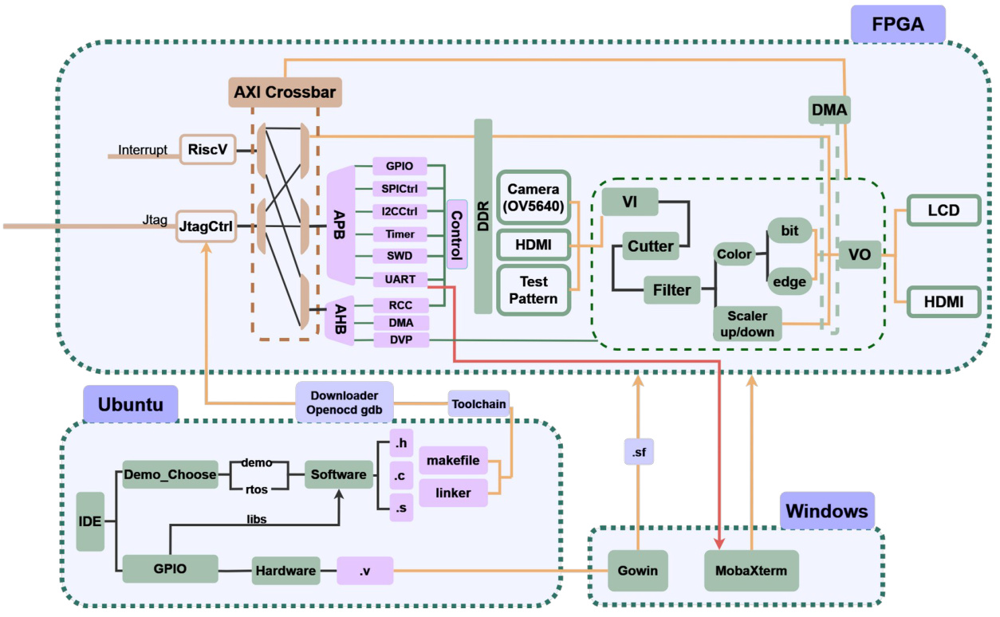
    图1. “睿视核”系统整体框图
</p>

<p align="center">
    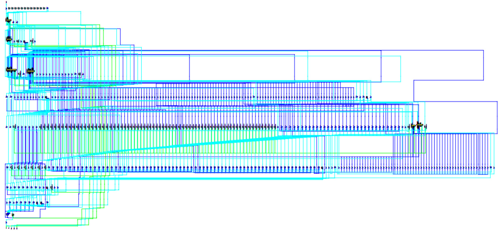
    图2. “睿视核”系统工程RTL图(高云IDE导出)
</p>

#### 系统架构

本系统由硬件和软件两大部分组成，协司工作以提供全面的视频处理解决方案。硬件部分包括基于RISC-√架构的处理器和专门设计的视频处理通路；软件部分则包含配套的集成开发环境(iDE)及配套支持库(libs、Makefile、linker)。

##### 硬件部分：

系统基于高云TangMega138KProFPGA开发平台，集成了视频处理所需的各类硬件模块。通过配置GPIO，生成对应的硬件描述文件(.V)。这些文件在高云IDE中经过综合、布局布线，最终通过编程器生成比特流文件(.fs)，并在Windows端烧录至PGA，实现硬件的动态配置和更新。

##### 软件部分：

软件开发环境位于Ubuntu虚拟机中，用户可在团队自主开发的IDE中进行操作。通过该IDE，用户能直观地配置GPIO并生成相应的库文件(libs)，选择所需的软件模型，进而编译生成对应的源代码(.c, .h)及makefile。随后，利用openocd和GDB工具链将生成的软件加载至RISC-V处理器。实时操作系统(RTOS)运行于Windows环境中，通过串口(UART)与开发板进行数据通信和指令传输。

##### 视频处理功能：

作为一个完整的视频处理系统，已集成包括视频倾裁剪、任意倍率视频流媒体缩放、边缘检测、图像二值化、颜色格式转换、图像补全和滤波等多种算法，能够对来自 HDMI或摄像头的输入视频帧进行处理，并将结果存储至板载DDR中。用户不仅可以在实时操作系统中运行已验证的视频处理算法，还可以根据需求，通过IDE在CPU上执行自定义的程序，以满足不同应用场景的特定要求。

#### 2. 各模块介绍

#### 2.1 系统软件：

##### 2.1.1 VexRiscV CPU

<p align="center">
    
    图3. VexRiscV CPU 核心框图
</p>

本系统处理器设计的结构包含一个核心CPU模块、总线交叉开关、外设接口和控制模块等部分。

##### 2.1.2 处理器核心

处理器核心采用RISC-V架构，能够处理中断信号以支持外部设备的实时控制。核心模块实现了支持RV32IM指令集，通过JTAG接口支持调试功能。处理器通过中断(interrupt)线与外设模块连接，响应不同外设的中断请求，从而确保系统的实时响应性；通过JtagCtrI模块实现调试功能，允许开发者通过JTAG接口调试处理器运行状态。

##### 2.1.3 AXI总线交叉开关

**AXICrossbar**：该模块实现了CPU与不同外设之间的高效连接。它允许处理器通过AXI总线访问多个外设模块，从而实现资源共享和数据传输[3];
**AHB和APB总线接口**：系统使用了AHB和APB总线标准，AHB总线用于较高性能的数据传输需求，而APB总线则用于较低速的外设控制接口[4]。

##### 2.1.4 外设模块

GPIO：通用输入输出模块，用于控制外部引I脚的输入输出，提供灵活的硬件接口。
SPI控制器：SPI模块用于与SPI外设通信，支持SPI协议的数据传输
12C控制器：12C模块用于支持12C协议的外设通信，如传感器或其他12C设备。
UART：串行通信接口，用于串行数据传输，适合与串口设备通信。
定时器(TIM)：定时器模块支持周期性事件的触发，主要用于计时操作和产生中断。
看门狗(WDT)：(窗口、独立)看门狗模块用于监控系统运行状态，防止系统失控。
DMA控制器：DMA模块实现了直接内存访问控制，提升数据搬运效率，减轻CPU负担。
RCC模块：时钟和复位控制模块，用于管理系统的时钟信号及复位控制。
DVP模块：视频处理模块，实现特定场景下的RISC-VCPU的处理系统应用。

##### 2.1.5 视频通路

<p align="center">
    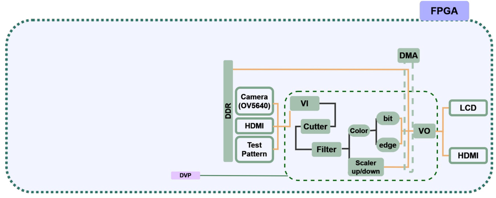
    图4. 视频处理通路框图
</p>

视频处理通路依据视频流媒体数据流动及功能具体分成视频输入(VI)，视频处理(VP)和视频输出(VO)三个部分。

##### 视频输入 (VI)

视频输入(VI)模块是一个多功能视频采集和处理单元，旨在从CMOS图像传感器或内置测试图案生成器中获取图像数据，并对其进行格式转换和信号同步输出，以供后续的视频处理模块使用。该模块的核心功能包括：基于外部CMOS图像传感器的数据采集与初始化配置、测试图案的生成与输出选择以及8位数据到16位数据的格式转换该模块主要支持两种输入模式：测试图案模式和CMOS数据模式。当模式设置为测试图案时，VI模块激活内部的testpattern子模块生成图案数据。testpattern模块依据配置生成预设的测试图形(如彩条、灰阶或网格图案)与行同步、场同步以及数据使能信号一并输出。模块将接收到的测试图案数据转换为RGB565格式输出，同时控制同步信号、场同步和使能信号的输出，以保证测试图案的时序同步；当设置为CMOS数据模式时，VI模块通过与CMOS图像传感器的接口，利用内部的CAM子模块实现对CMOS传感器的配置和数据米集。首先，CAM模块通过I2C通信方式与CMOS传感器建立联系，配置其工作参数，包括分辨率和帧率等，以确保图像传感器的输出符合预期的规格。在配置完成后，CAM模块在CMOS传感器的像素时钟驱动下，逐行接收图像传感器传输的像素数据。图像数据的有效区域通常由CMOS传感器的水平和垂直参考信号进行标记，以指示当前数据是否有效。为适配后续处理需求，CAM模块内部包含一个数据格式转换子模块，将传感器输出的8位数据转换为16位RGB565格式。这种格式转换确保了数据能够与后续模块的输入格式一致。转换后的16位数据通过CAM模块输出至VI模块的主数据接口。同时，CAM模块生成的控制信号用于标记数据的有效性和同步性，确保数据流在整个系统中的连续和同步。VI模块可通过配Vl Control Register。

<p align="center">
    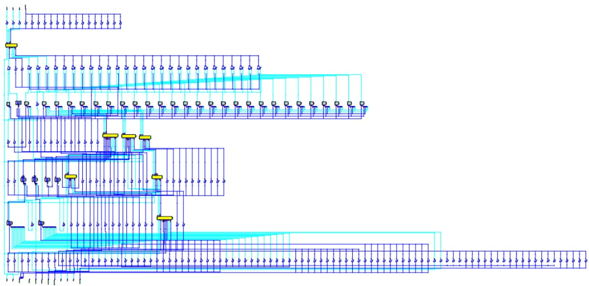
    图5. 视频处理(VP)模块RTL图(高云IDE导出)
</p>

##### 视频处理(VP)

视频处理模块用于对输入的视频流数据进行多种图像处理操作，具体包括裁剪、滤波、缩放、颜色空间转换、边缘检测、二值化和填充等功能。VP模块可以根据控制寄存器的配置，动态启用或禁用这些处理功能，从而支持多样化的视频应用场景。

VP模块接收来自VI模块的数据，通过多个功能模块依次对数据进行处理，最终输出处理后的数据流。以下是√P模块内主要的数据流动过程和功能模块的处理步骤，所有VP Control Register：

1. 输入与信号转换
输入的视频数据以16位RGB565格式接入VP模块。数据在进入VP模块后，首先转换为24位的RGB格式，以满足后续模块的处理需求。模块内有视频有效信号(de)和垂直同步信号(vs)来确保数据处理的时序和有效性。
2. 裁剪
当裁剪功能被使能时，裁剪模块会根据设定的起始(START)和结束(END)坐标，将输入图像裁剪到指定的区域，去弃剩余部分。这一功能用于聚焦图像中的感兴趣区域。裁剪区域的起始和结束坐标由配置寄存器设定，由用户基于UART通信指定。
3．滤波
滤波模块用于对图像进行平滑处理，以减少噪声或增强图像细节。支持的滤波模式包括高斯滤波、均值滤波和中值滤波。滤波功能的启用及滤波模式均由用户通过串口通信配置寄存器控制。滤波操作可以使图像更加平滑，从而改善视觉效果。
4. 缩放
缩放模块可以对图像进行放大或缩小处理，支持多种插值算法，包括邻近插值和双线性插值。缩放倍率由分辨率寄存器设定，以达到指定的输出分辨率。该模块的时钟由输入信号驱动，并根据图像需求动态调整数据大小
5. 颜色空间转换
颜色空间转换模块用于将RGB格式转换为灰度(Y通道)，以便后续的图像分析处理。这种转换降低了数据复杂性，适用于边缘检测和二值化等操作。该模块可以通过配置寄存器选择是否启用，支持不同的转换模式。
6. 边缘检测
边缘检测模块可以提取图像中的轮廓和边界，以突出物体的形状。该模块支持Sobel和Prewitt两种边缘检测算法，适用于不同的检测需求。边缘检测的國值可以通过值寄存器配置，从而调整边缘检测的灵敏度[5，6]。
7. 二值化
二值化模块将图像灰度值转换为黑白两值，以简化图像结构并便于进一步分析。二值化支持正向和反向模式，由配置寄存器选择。值寄存器用于设定二值化的判别标准，以控制亮度分界。
8. 填充
填充模块用于在缩放图像的分辨率小于输出分辨率时，对图像边缘进行填充。填充的颜色可以选择黑色、白色或自定义颜色。填充功能通过配置寄存器使能，适用于图像显示需求较高的场景。

##### 视频输出 (VO)

视频输出模块(VO模块)用于将视频数据输出到HDMI接口。它负责从输入的视频数据生成HDMI所需的时序信号和差分信号，并确保视频数据在正确的时间和位置输出到显示器上。VO模块主要由输入处理、时序生成和HDMI传输三部分组成。VO模块接收来目√P模块的16位视频数据。当信号有效时，将输入的数据映射为完整的24位RGB数据，并生成输出显示时钟。该处理包括从输入信号中解析出红、绿、蓝三基色信号的每一位，并按HDMI显示要求的格式进行拼接。经过时序生成模块的处理后，生成的时序信号以及处理过的RGB数据输入到DVI/HDMI传输模块。此模块通过差分传输生成HDMI所需的TMDS信号(传输最小差分信号)，包括时钟信号和TMDS数据信号。本系统支持LCD，HDMI等视频输出方式供用户选择，通过VOControlRegister。

#### 2.2 系统软件：

Ubuntu端(IDE)，Windows端(UART)

<p align="center">
    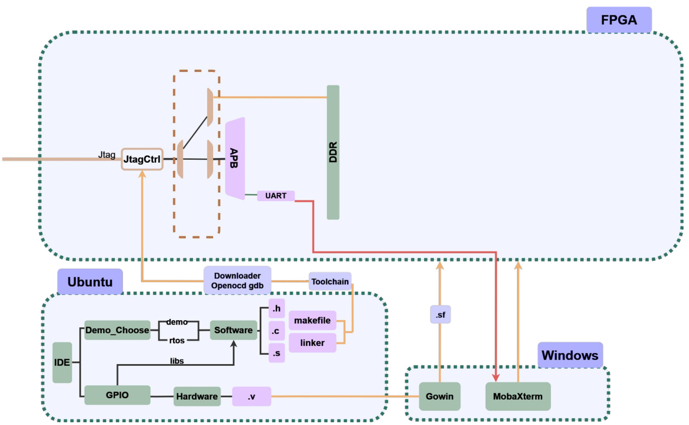
    图6. Ubuntu端(IDE)，Windows端(UART)
</p>

本系统软件设计方案涵盖了嵌入式系统开发流程，包括代码编译、硬件配置、与FPGA的交互、以及调试等多个模块。

##### 2.2.1 开发环境与软件结构

**操作系统与IDE**：开发环境基于Ubuntu系统，其中集成了一个IDE(集成开发环境)以管理和编辑代码。IDE允许用户在同一界面中选择示例程序、编辑软件代码、生成硬件代码模块等。

**软件结构**：
1. Demo_Choose：该模块用于选择要执行的示例代码。用户可以选择不同的示例程序，以便进行不同的功能测试和验证。
2. Software：此模块包含主要的业务逻辑代码main和底层接口(如RTOS实时操作系统函数调用)。所有程序逻辑和控制流程均在此模块中实现。
3. Hardware：包含与硬件相关的代码文件，如GPlO(通用输入输出接口)配置模块和硬件描述文件(Verilog)。这些模块将具体的硬件行为封装为软件可调用的接口。
4. 代码扩展：除上述模块外，还包括libs库文件和链接文件。库文件(如.h头文件, .c源文件和.S汇编文件)包含函数定义和硬件抽象接口，而链接文件(linker)则用于将各个模块正确链接为可执行程序。

##### 2.2.2 代码编译与构建流程

**Makeflle**：构建过程由Makefile文件管理，该文件定义了编译流程和依赖关系。在执行构建命令时，Makefile会依次编译各个模块的源文件，并将生成的目标文件链接成可执行的固件文件。
**链接与地址分配**：编译后，通过链接文件确保各个模块的代码和数据被正确地放置在指定的内存地址。这样，生成的可执行文件可直接加载到FPGA的DDR存储器中。

##### 2.2.3 下载与调试工具

**OpenOCD**：使用OpenOCD(开放式片上调试器)工具将编译生成的程序下载到FPGA DDR。
**GDB调试**：GDB(GNU调试器)与OpenOCD配合使用，用于程序调试。开发人员可以通过GDB设置断点、查看内存、监控寄存器状态等，从而实时监控和调试程序。
**UART下载**：烧录裸机开发中boot固件。

##### 2.2.4 与FPGA的串行通信

**串口通信**：在Windows系统中，通过UART(通用异步收发传输器)与FPGA进行串行通信。串口通信模块将FPGA的输出数据传输到PC端，便于开发人员实时观察FPGA的运行状态和输出结果。
**工具链**：Gowin提供FPGA开发工具链，提供下载和配置支持。通过Gowin，开发人员可以将.SVf格式的固件文件下载到FPGA，从而实现系统配置和功能验证。

##### 2.2.5 功能与流程概述

该系统的工作流程首先在Ubuntu中通过IDE选择示例程序并完成代码编写，然后使用Makefile进行编译和链接生成可执行文件。在程序下载至FPGA后，通过GDB调试程序或通过UART与FPGA进行数据交互。Windows端则主要负责串口监控，以便于调试和结果观测。

### 第三部分 完成情况及性能参数

#### 3.1 IDE

本团队自主开发的IDE页面(如图7所示)简洁清晰，支持多种集成开发功能。

<p align="center">
    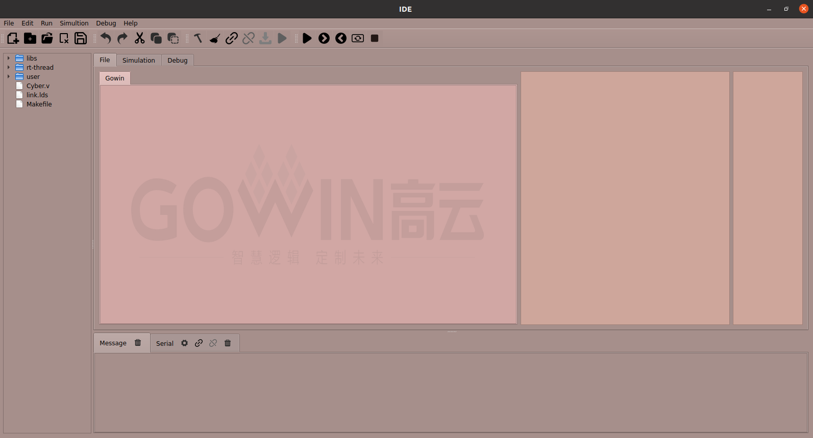
    图7. IDE页面
</p>

**(1)项目管理**：用户可以在IDE中创建、打开并管理多个项目文件，使开发流程更加高效。为了提升使用舒适性和操作流畅度，当用户选择目标文件时，系统会自动将该文件的所在目录导入到IDE页面左侧的文件资源管理栏中，便于用户在一个窗口内快速切换和访问文件。文件资源管理栏支持分层显示和目录树操作，用户可以在其中直接查看、编辑和管理项自文件结构。此外，通过资源管理栏上方的按钮，用户可以方便地进行文件重命名、删除、复制等操作，从而进一步提高项目管理的便捷性和操作效率(如图8所示)。

<p align="center">
    
    图8. 资源管理栏
</p>

**(2)工程配置**：支持用户在IDE新建项目(如图9所示)，可以兼容多类型核用户可以按照自己的需要进行AHB或者APB使能，如果无指定核，勾选Cyber"，即可生成团队制作的轻量核Cyber.h。

选择完成后，可以在可视化页面上进行GPIO的自主配置(如图10所示)。此配置页面支持串口增加，引脚选择，初始引脚无效化，以及自动报错。配置完成后点击生成按钮，则自动生成顶层Cyber.v文件。

<p align="center">
    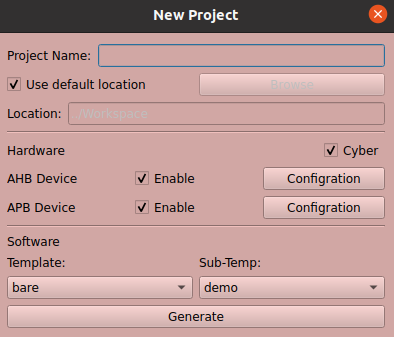
    图9. 新建项目窗口
</p>

<p align="center">
    
    图10. GPIO自主配置窗口
</p>

<p align="center">
    
    图11. 生成.v硬件文件
</p>

**(3) 软件编译**：用户在选择或创建代码文件后，该文件会在IDE的file页面中央编辑窗口中展示(如图12所示)。用户可以在此中央窗口进行代码的编写与修改，享受便捷的编辑体验。编写完成后，用户可点击页面上方的“编译”、“运行”、“调制”按钮，后台会根据所选操作执行对应的工作流程。

若用户选择“编译”操作，系统将自动编译当前代码，并在页面右侧的“AssembleCode"和“MachineCode"区域(如图12所示)实时显示编译生成的汇编码和机器码。这些区域提供了汇编语言与机器码的直观展示，便于用户进行代码性能分析与优化。通过这种直观的编译反馈，用户能够迅速检测并纠正代码中的错误，优化代码逻辑，从而显著提升开发效率。

<p align="center">
    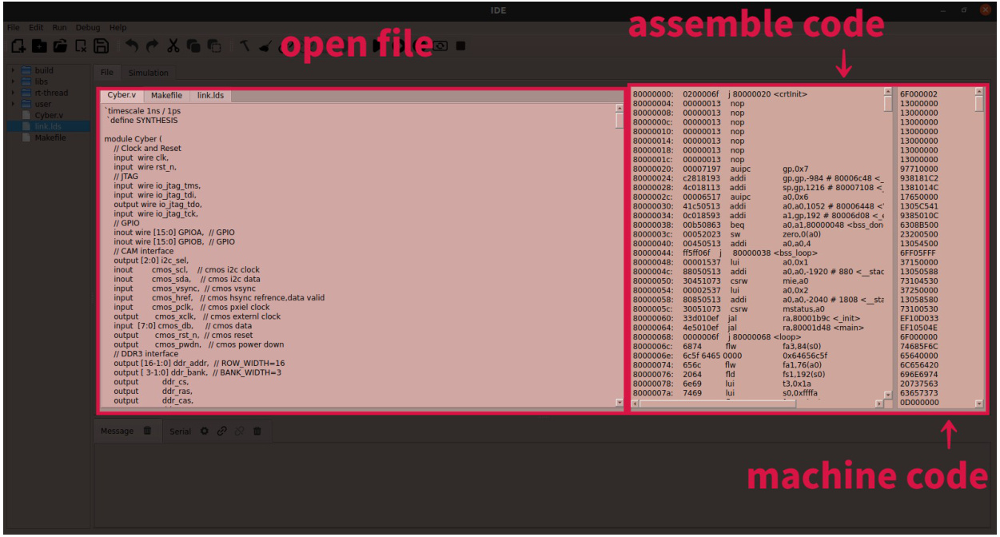
    图12. 编译文件，生成汇编码和机械码
</p>

<p align="center">
    
    图13. 步进汇编码，进行仿真
</p>

<p align="center">
    
    图14. Message 消息
</p>

**实时操作系统及对应视频通路算法**

本团队开发的完整视频处理通路算法已成功通过GDB工具将可执行文件(.elf文件)下载至板载DDR内存。用户在登录系统时，可以选择裸机升发或选择任一实时操作系统(RT-Thread Free RTOS，推荐使用RT-Thread，)来输入指令并运行程序。在用户登录界面(如图15所示)，系统要求用户输入密码以确保访问安全。成功登录后，用户可以使用“list"指令(类似常用的“help"指令)查看可供执行的程序列表，通过“list-thread"指令则可查看当前CPU正在运行的所有线程为提升系统的用户友好性，本系统集成了一系列交互式功能。例如，在登录过程中，如果用户输入密码错误，系统会及时提醒用户重新输入。此外，系统支持指令的自动补全功能，用户可以通过按下“Tab"键完成指令中部分字母的补全，从而提高操作效率。这些功能设计旨在优化用户的操作体验，确保用户在实时系统中可以高效、便捷地控制和执行所需的程序。

<p align="center">
    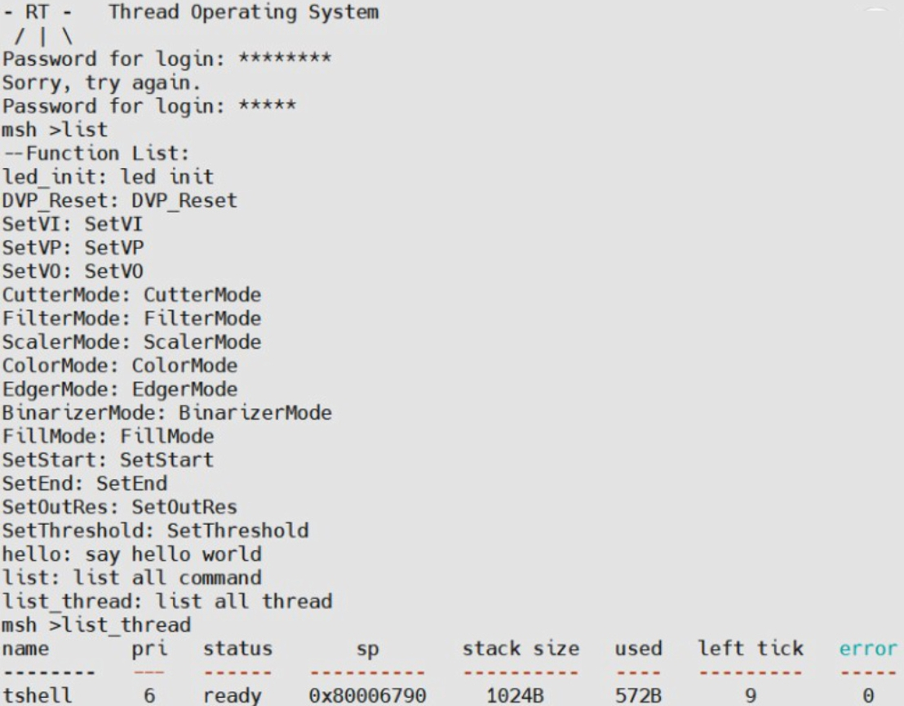
    图15. 登录实时操作系统，查看Demo及线程
</p>

以OV5640摄像头作为视频输入源为例，配置为 1280*720 视频帧输入FPGA。通过如图16所示指令设置视频缩小模式，用"SetOutRes756423"将 1280*720 视频帧缩小至 756*423 ，并通过"Fl指令将屏幕剩余部分填充为黑色，防止执行缩小指令前一帧缓存图像同时与缩小后的实时显示视频帧图像同时呈现在屏幕上。

<p align="center">
    
    图16. 视频缩小并填充空白指令
</p>

指令设置视频放大模式，利用"SetOutReS1280720"设置输出图像像素为  1280*720  ，放大区域通过"SetStart12364"和"SetEnd802400"确定区域的起始
点和终止点坐标为(123，64)，(802，400)。

视频放大缩小如图17，以一位队员手拿平板站在距离摄像头相同距离和角度位置进行三种情况下拍摄：原图，缩小图，放大图。如图所示，视频放大缩小均可实时处理，清晰度高、低延迟。

<p align="center">
    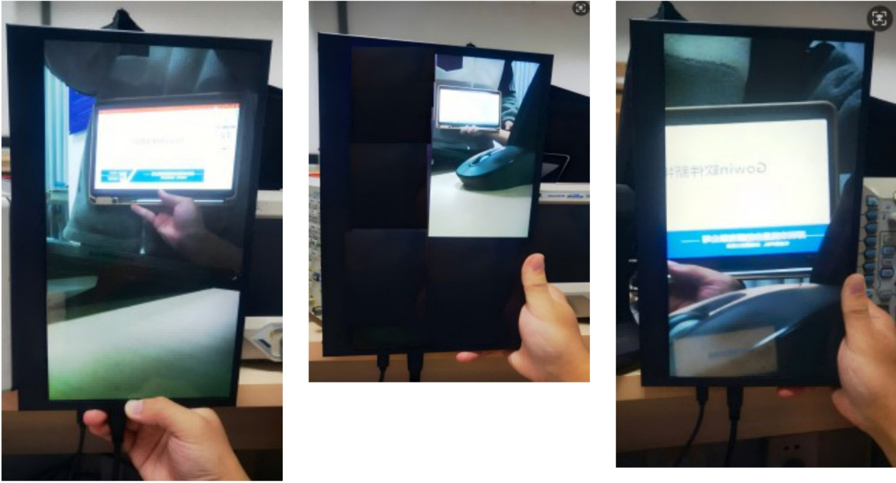
    图17. 三种情况下拍摄的视频
</p>

#### 3.2 CPU部分仿真波形

项目完成多种自定义外设：定时器(timer)、GPIO、SPI、UART、中断以及看门狗。表1为APB总线信号名称定义及说明：

<div align="center">

表1. APB总线仿真波形信号名称定义及说明

| **APB 总线信号名称**   | **信号定义及功能说明**                     |
|-----------------------|-------------------------------------------|
| io_apb_PCLK           | APB 总线的时钟信号                        |
| io_apb_PRESET         | APB 总线复位信号，当为低电平时重置模块     |
| io_apb_PADDR          | APB 地址总线，用于选择 GPIO 的寄存器       |
| io_apb_PSEL           | APB 选择信号，用于选择 GPIO 模块           |
| io_apb_PENABLE        | APB 使能信号，当高电平时表示传输有效       |
| io_apb_PWRITE         | APB 写使能信号，为高时表示写操作，为低时表示读操作 |
| io_apb_PWDATA         | APB 数据总线，用于写入数据                 |
| io_apb_PRDATA         | APB 数据总线，用于读取数据                 |

</div>

<div align="center">表2. GPIO配置寄存器名称说明

| **GPIO配置寄存器**     | **信号定义及功能说明** |
|:---------------------:|:---------------------:|
| CRL and CRH           | IO配置寄存器          |
| BSRR                  | IO置位/复位寄存器      |
| IDR                   | GPIO 的输入数据寄存器  |
| ODR                   | GPIO 的输出数据寄存器  |

GPIO配置与推挽、开漏输出波形如下图所示。CRL和CRH于配置GPIO引II脚的推挽输出、开漏输出和输入模式等，图中的配置波形表明了通过PADDR和PWDATA来配置CRL和CRH。IDO和ODR分别用于读取和写入GPIO引I脚的状态。在推挽模式中配置GPIO引I脚为推挽模式后，ODR寄存器的值直接控制输出电平，可用于驱动高低电平；在开漏模式中，配置GPIO引I脚为开漏模式后，ODR写"O"时输出低电平，与"1"时引脚悬空(高阻状态)。这种模式适合用于总线通信电路。

</div>

<p align="center">
    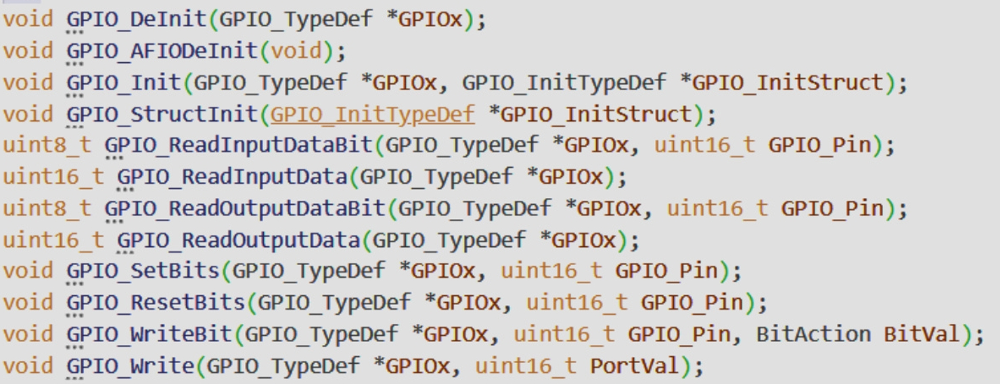
    图18. GPIO 部分函数原型
</p>

<p align="center">
    
    图19. GPIO 配置、推挽开漏输出仿真波形
</p>

UART配置、发送接收中断波形如下图所示。UART配置阶段，通过BRR寄存器设置UART的波特率，以控制数据传输速度。如图，波形中PWDATA中的数据被写入到BRR地址，这一过程中UART的波特率配置成功。通过CR1和CR2寄存器配置UART的工作模式，并使能发送和接收中断。通过设置CR1中的相应位，UART可以被配置为在接收到数据或发送完成时触发中断信号。数据发送和接收阶段，数据被写入到TX寄存器。每次写入数据后，UART模块会将数据通过UART TX信号发送出去。在波形中可L以观察到UART TX信号的波形变化，表明数据正在逐位发送。UART在UART RX上接收数据，数据会逐位进入UART的接收缓冲区。接收到一个完整字节的数据后，会将其放入RX寄存器中。在波形图中标记的“UART中断处理函数”表示在中断触发后，CPU进入中断服务程序(ISR)。ISR会读取SR中的标志位以确定是发送完成还是接收完成，然后根据情况进行相应处理(如读取接收的数据或准备发送新的数据)，实际仿真波形符合预期设计。

<p align="center">
    
    图20. UART 部分函数原型
</p>

<p align="center">
    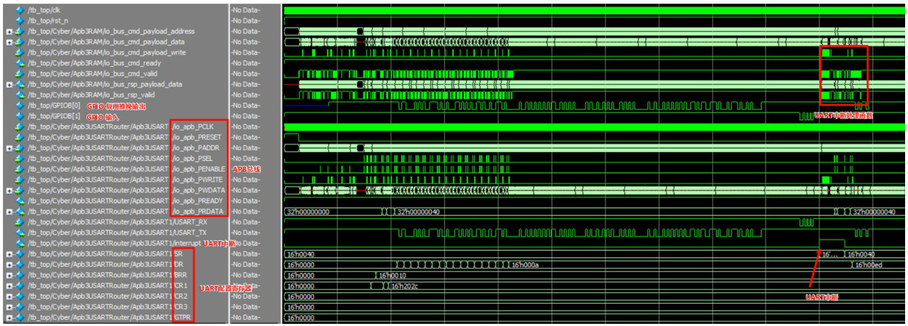
    图21. UART 配置、发送接收中断波形
</p>

SPI配置、输出波形如下图所示。在SPI配置阶段，通过APB总线向CR1和CR2寄存器写入值，配置SPI通信的参数。配置寄存器的操作通过PADDR地址核PWDATA数据总线完成，PWRITE为高表示写入操作，PSEL和PENABLE共同控制数据的传输有效性。发送数据(MOSI)时，主设备要发送数据时，将数据写入DR寄存器。波形中可以看到在PWDATA上有多个数据写入操作，这些数据被传输到MOSI信号线上。接受数据(MISO)时，MISO信号线用于接收从设备返回的数据，并存储到DR寄存器中。通过PRDATA可以读取到MISO接收到的数据。通信开始时，主设备将CS信号拉低，从而选中对应的从设备。当CS低电平时，SPI数据传输有效，CS返回高电平则结束传输。当传输完成时，SPI模块可以触发中断，通知CPU进行后续处理，由SR信号设置相应的标志位。波形展示了APB总线如何通过寄存器配置SPI模块，以及SPI数据传输过程中SCK、MOSI、MISO和CS的信号变化情况。这种配置和传输过程是典型的SPI通信协议流程，与预期效果一致。

<p align="center">
    
    图22. SPI 端口API函数原型
</p>

<p align="center">
    
    图23. SPI配置、输出波形
</p>

**定时器(TIM)**:

<div align="center">

表3. 定时器配置寄存器名称说明

| **TIM 寄存器名称**   | **信号定义及功能说明** |
|---------------------|-----------------------|
|CR1	     | 器控制寄存器1，用于启用定时器、设置定时器工作模式、计数方向等 |
|CR2	     | 时器控制寄存器2，通常包含额外的功能配置选项，如输出控制等 |
|DIER	     | 断使能寄存器，用于使能定时器的中断 |
|SR	         | 寄存器，用于指示定时器的状态，如更新事件、捕获比较事件等 |
|EGR	     | 件生成寄存器，用于生成更新事件（如重载计数器值） |
|CCMR1 CCMR2 | 比较模式寄存器，配置输出比较模式或输入捕获模式，这里用于PWM输出模式配置 |
|CCR	     | 获/比较寄存器，控制 PWM 信号的占空比，即信号高电平持续时间 |
|PSC	     | 分频寄存器，用于设置定时器的时钟分频系数，控制定时器计数速度 |
|ARR	     | 重装载寄存器，用于设定定时器的周期。计数器达到ARR值时会重装载并触发更新事件 |

</div>

定时器配置、PWM输出波形如下图所示。在定时器配置阶段，通过CR1控制寄存器启用定时器，定时器开始计数。CR1中的相关位设置定时器的工作模式(如向上计数或向下计数)，控制定时器是否立即启动。在PWM波形配置中，通过CCMR1或CCMR2的值决定PWM信号的模式，例如边沿对齐模式或中心对齐模式并实现PWM信号的频率和占空比控制。CR捕获/比较寄存器与入数值，定义PWM信号的高电平持续时间，占空比的值决定了信号的高低电平比例。例如，设置CCR值为 50 时，PWM信号的高电平时间为半个周期。波形图展示了定时器通过PWM输出模式的配置和生成PWM信号的过程，主要关注了定时器的周期设置和占空比调整。通过配置CCMR和CCR寄存器，可以灵活控制PWM信号的输出特性，波形符合预期

<p align="center">
    
    图24. 定时器端口API函数原型
</p>

<p align="center">
    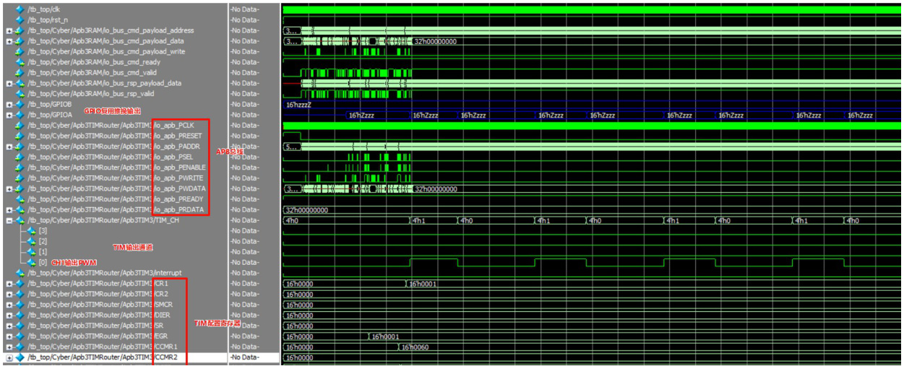
    图25. 定时器配置、PWM输出波形
</p>

定时器配置、定时中断波形如下图所示。定时器达到自动重装载值并触发更新事件时，会产生中断信号。该信号用于通知CPU处理定时器中断服务程序(ISR)。定时器配置阶段，进行使能和模式设置并预分频和重装载值。通过写入PSC和ARR寄存器，设置定时器的时钟分频值和自动重装载值。在DIER寄存器中设置相应的位，启用定时器更新中断。定时器从○开始计数，按照预设的分频因子逐步增加。当计数值达到ARR的设定值时，计数器会重置，同时生成一个更新事件。当定时器的计数器达到ARR值并重装载时，更新事件触发中断。波形中可以看到在特定时刻TIM中断信号被拉高，表示中断已触发。中断触发后，CPU进入中断服务程序(ISR)，对定时器溢出事件进行处理。从波形图中可以看到，定时器的中断信号在固定的时间间隔内反复触发，形成一个周期性中断，符合设计。

<p align="center">
    
    图26. 定时器配置、定时中断波形
</p>

独立看门狗(IWDG)配置、看门狗复位输出波形如下图所示。MDG配置阶段，波形中可以看到PADDR选择了PR寄存器的地址，并且PWDATA写入了预分频值。例如，12h01e表示写入特定值来配置IWDG的预分频参数，改变计数器的递减速度。在另一个时间点，PADDR指向RLR寄存器地址，PWDATA中写入了重装载值(例如32h00000073)，这表示当计数器从此值递减到0时，将触发复位操作。喂狗操作(KR寄存器写入)中，可以看到PADDR选择KR寄存器地址，并且PWDATA写入了特定的喂狗值。这会将计数器重置为RLR寄存器中的重装载值，防止看门狗触发复位。PR和RLR寄存器分别用于设置计数器的预分频和重装载值，控制计数器的倒计时间隔和复位时间。通过此波形图验证了包括计数器倒数、喂狗操作及寄存器配置生效，验证了WDR模块的基本功能。

<p align="center">
    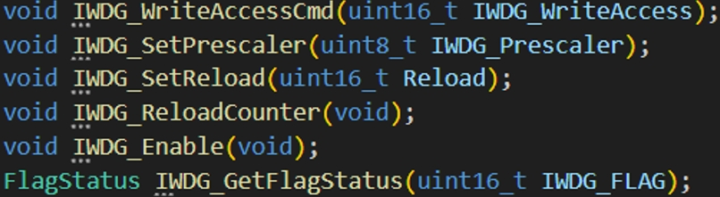
    图27. 独立看门狗端口API函数原型
</p>

<p align="center">
    
    图28. IWDG配置、看门狗复位输出波形
</p>

窗口看门狗(WWDG)配置、看门狗复位输出波形如下图所示。配置阶段，通过PADDR选择CFR寄存器地址，入特定的预分频值和窗口值以设置计数器的时间窗口。窗口值决定喂狗的时机，如果喂狗过早或过晚都会导致复位。例如，8c0和7h40表示设置窗口的上限和下限，只有在该窗口内进行喂狗操作才是有效的。波形图展示了包括设置窗口和预分频因子以及在窗口期内进行喂狗操作等配置过程，符合预期[7, 8]。

<p align="center">
    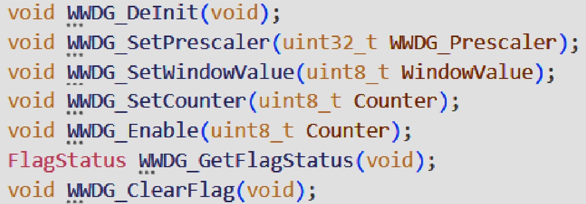
    图29. 窗口看门狗端口API函数原型
</p>

<p align="center">
    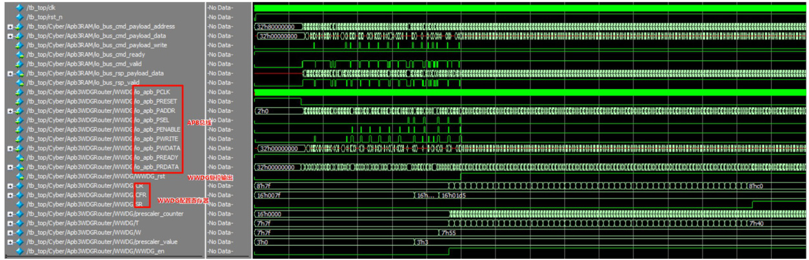
    图30. WWDG配置、看门狗复位输出波形
</p>

#### 3.3 视频通路仿真波形

视频通路硬件实现仿真结果，使用例程中testpattern.v生成的彩条进行仿真。彩条图案由8种颜色组成，每种颜色的宽度为水平分辨率的1/8，颜色顺序是白色、黄色、青 色、绿色、洋红、红色、黑色和蓝色并且这些颜色依次在水平方向上显示形成彩条。缩放部分本团队已开发双线性插值和邻近域算法供用户使用，此处仿真结果均使用验证效果更佳的双线性插值算法。

**放大**：这里设置为切割出视频流每帧的中间172部分，并把切出的图像放大为原来两倍。此处使用 1280*720 像素彩条进行仿真。当prede为高电平时，表示当前时刻的像素输入数据是有效的图像数据，格式为24位宽的RGB888信号。cutter为负责图像剪切的模块。输入图像在经过cutter模块后，输出的是剪切后的数据(即选定区域的图像数据)，然后送入下一级的filter模块对图像数据进行平滑或边缘处理。在放大时，插值会在原始像素之间生成新的像素，因此postdata会包含中间颜色的值，而不是简单的重复。例如，颜色从24h3e003e到24hba00ba之间，插值可能生成中间值，逐步过渡；post_de会更频繁地为高电平，意味看输出的有效数据更多，因为插值生成了更多的中间像素。仿真结果表明图像被放大了，仿真结果理想且正确。

<p align="center">
    
    图31. 原图放大至二倍(双线性插值算法)波形
</p>

**缩小**：将摄像头采集并传入的1280*720图像缩小至原来的1/2像素大小，并置于屏幕左上角位置显示。此处使用1280*720像素彩条进行仿真。与放大部分数据流类似，经过cutter及filter模块后进入scaler进行缩小。在缩小时，双线性插值会对原图多个像素进行加权平均，这样可以在缩小后的图像中保留更多细节。同样，post_data中的数据会是多个像素的混合值。由于输出数据减少, post_data的高电平相对稀疏。波形仿真表明图像被缩小，结果符合预期且正确。

<p align="center">
    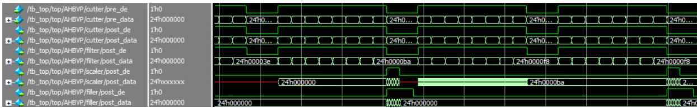
    图32. 将原图缩小至1/2(双线性插值算法)波形
</p>

**图像二值化**：将摄像头输入的RGB565图像转化成本黑白图像输出。二值化后的数据 通常是1位的数据，每个像素点只有0或1两种状态。0通常代表黑色，1代表白色。因此，高电平表示该像素点被判断为白色，而低电平表示该像素点被判断为黑色。通过观察postbit的变化，可以看出哪些像素点被判定为黑或白，形成黑白图像。

<p align="center">
    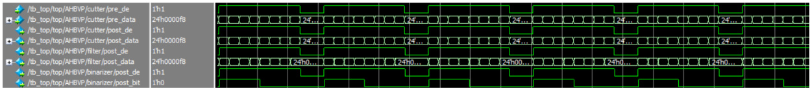
    图33. 图像二值化波形
</p>

**边缘检测**：对摄像头输入的RGB565图像进行物体的轮廓识别，边缘部分使用白色勾勒，其余部分使用黑色填充凸显轮廓。观察到edge/post_bit信号的变化，查看经过边缘检测处理后的图像。通过postbit信号的高低电平可以确定哪些像素属于边缘，哪些像素属于背景。post_bit信号为高电平(1)时，表示该像素被检测为边缘，应该以白色显示。这些高电平脉冲在postbit中以较短的间隔分布，表示检测到图像的边缘轮廓。post_bit信号为低电平(o)时，表示该像素属于背景，应该以黑色显示。大部分post_bit保持低电平，表示图像的背景区域没有显著变化。从仿真结果可以看出，post_bit在每一帧图像仿真中拉高8次，对应彩条八个色块与边缘之间的颜色变化间隙，仿真结果符合预期。

<p align="center">
    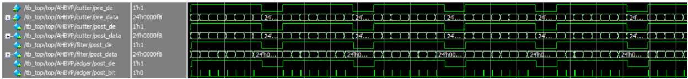
    图34. 边缘检测波形(sobel算子)
</p>

#### 3.3 资源消耗

<p align="center">
    
    图35. “睿视核”系统资源消耗
</p>

本系统资源消耗如图31所示，主要包括寄存器(Register)、查找表(LUT)、算术逻辑单元(ALU)、块状SRAM(BSRAM)和切片SRAM(SSRAM)等资源。各模块在FPGA上的资源消耗根据功能划分，并以层次结构展示。

**总体资源使用**：项目的顶层模块“Cyber"总共消耗了12，617个寄存器和23，210个LUT。这些资源主要由子模块组成的功能单元使用，以实现各模块的核心功能。

**核心模块资源使用**：
**VexRiscv**：作为RISC-VCPU核心模块，Vex Risc V，包括923个寄存器和1930个LUT。这表明CPU核心的实现需要较多的逻辑资源和存储资源，用于支持复杂的运算和控制功能。
**AhbDVP**：该模块主要负责数据处理和传输，使用了8288个寄存器和18076个LUT，消耗量较高。这是因为该模块涉及较多的数据操作与通信逻辑。
CAM：AhbDVP模块下的子模块CAM也使用了相对较多的资源，特别是930个LUT和249个寄存器。这说明CAM模块在进行数据处理时需要较高的逻辑运算资源。
**其它模块**：如“AhbBridge"、“AhbRouter"、“Master Arbiter"等模块的资源消耗较低，这些模块的功能相对简单，主要负责系统中不同组件间的通信与仲裁，因此对资源的需求较少。

#### 3.4 性能参数

##### 时钟频率(不同外设等情况下数据)

对于最小系统(无外设)，最大时钟频率如图32所示：

<p align="center">
    
    图36. 最小系统最大时钟频率
</p>

对于完整CPU处理系统，最大时钟频率如图33所示：

<p align="center">
    
    图37. 最大实际时钟频率均可超过开发板晶振频率50MHz
</p>

##### 功耗分析：

对于最小系统(无外设)，功耗数据如图34所示：

<p align="center">
    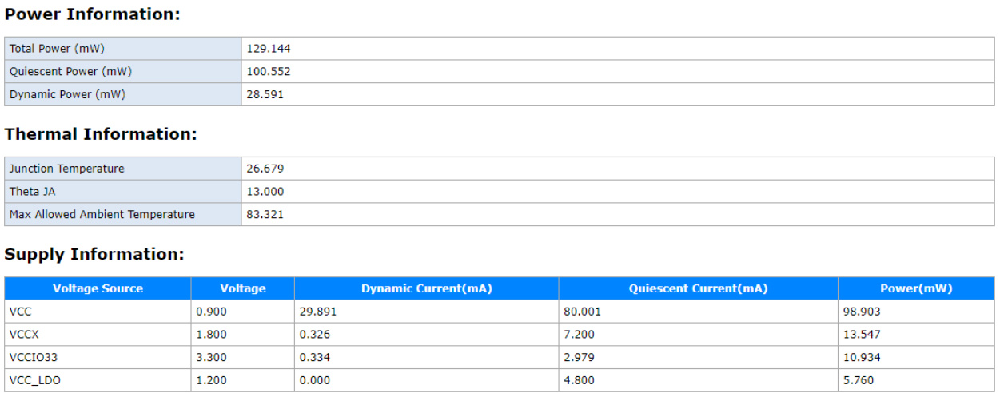
    图38. 最小系统功耗
</p>

对于完整CPU处理系统，功耗数据如图35所示：

<p align="center">
    
    图39. 最大系统功耗
</p>

对于本团队开发具有视频处理应用功能的“睿视核”工作系统。从以上数据可以看出，该系统的功耗分布合理，动态功耗和静态功耗均被有效控制。结温远低于系统允许的最高温度，这表明散热设计满足系统要求，并且提供了一定的温度裕度，有助于提高系统的长期可靠性。

##### 峰值信噪比(PSNR)与结构相似性(SSIM)

PSNR是根据图像和算法处理后的输出图像在同一个坐标下的像素值的差异来评估缩放图像的质量，通常以分贝(dB)为单位表示。它是两个图像之间的最大可能像素值和均方误差(MSE)之间的比率的对数表达。这个值越大，表示图像失真越小。表达式为：

$$
\text{PSNR} = 10 \cdot \log_{10} \left( \frac{L^2}{\text{MSE}} \right)
$$

其中：

1. MSE (均方误差)：
   $$
   \text{MSE} = \frac{1}{MN} \sum_{i=1}^M \sum_{j=1}^N \left[ X(i,j) - Y(i,j) \right]^2
   $$
   - \(X(i,j)\)：原始图像中位置 \((i,j)\) 的像素值  
   - \(Y(i,j)\)：重建或压缩图像中位置 \((i,j)\) 的像素值  
   - \(M\) 和 \(N\)：图像的宽度和高度，即总像素数为 \(M \times N\)

2. L (最大像素值)：
   - \(L\) 是图像的最大像素值，对于 8 位图像，通常 \(L = 255\)。

PSNR的值越高，表示图像质量越接近原始图像。通常情况下，PSNR在30dB以上表示重建图像质量较好。

SSIM是通过比较图像的亮度、对比度和结构来衡量图像相似度的指标。与PSNR不同，SSIM更关注图像的结构信息，能够更好地捕捉人眼的感知效果。表达式为：

$$
\text{SSIM}(x, y) = \frac{(2\mu_x\mu_y + C_1)(2\sigma_{xy} + C_2)}{(\mu_x^2 + \mu_y^2 + C_1)(\sigma_x^2 + \sigma_y^2 + C_2)}
$$

其中：
- \(\mu_x\), \(\mu_y\)：图像 \(x\) 和 \(y\) 的均值（亮度）。
- \(\sigma_x\), \(\sigma_y\)：图像 \(x\) 和 \(y\) 的标准差（对比度）。
- \(\sigma_{xy}\)：图像 \(x\) 和 \(y\) 的协方差（结构相似性）。
- \(C_1\) 和 \(C_2\)：稳定常数，用于避免分母为零的情况，通常定义为：
  $$
  C_1 = (K_1L)^2, \quad C_2 = (K_2L)^2
  $$
  其中 \(L\) 是像素值的动态范围，\(K_1\) 和 \(K_2\) 是较小的常数（例如 \(K_1 = 0.01, K_2 = 0.03\)）。

SSIM的值介于-1到1之间，通常取0到1之间，1表示图像完全相同，0表示没有相似性。将PSNR与SSIM结合，可以获得更全面的图像质量评估[9]。

本团队利用matlab编写程序对于图片进行放大缩小进行测试，验证视频流媒体缩放硬件算法部分使用的双线性插值和邻近域算法的有效性，程序置于附录中。由于缩放后图像像素尺寸与原图不同，因此需要上采样或下采样缩放后图像与原图像进行对比[2].

采用本项目基于的Tang Mega 138K pro 开发板的图片进行验证演示。考虑到报 告篇幅问题，采用较小分辨率图像及较小放大倍数演示验证：生成图像放在 Algorithm 文件夹中。

通过计算，得到双线性插值和邻近域算法在放大和缩小上述验证中的PSNR和SSIM指标如表4所示。

<div align="center">

表4. 视频流媒体缩放算法验证及对比

| 算法选择/模式选择	| 双线性插值 | 邻近域 |
| :-------------   | :------------- | :------------- |
| 缩小             | 33.27 dB / 0.8791 | 27.68 dB / 0.8536 |
| 放大             | 36.10 dB / 0.9228 | 29.54 dB / 0.8924 |

</div>

如表4所示的PSNR值以及SSIM结果说明缩放后图像质量较高，充分展示了我们的视频流媒体缩放算法的有效性。

### 第四部分 可扩展之处

##### 4.1 硬件架构搜索与视频处理路径扩展

板载DDR中预置了本团队开发的视频流媒体处理算法，包括滤波、缩放和边缘检测等模块，以形成完整的视频处理路径。用户可灵活选择并组合这些硬件算法模块，从而实现自定义视频处理流程，以适应特定应用场景的需求[10]。“睿视核”系统将为用户提供灵活的配置选项，支持个性化视频处理设置，尤其适用于不同监控需求、视频增强处理、实时图像分析等场景。

##### 4.2 深层卷积神经网络(CNN)的硬件加速支持

系统提供了卷积加速接口，充许用户基于硬件平台自定义并实现多层卷积神经网络，从而执行复杂的图像处理算法，如YOLO用于目标识别、分类和物体定位[11, 12, 13]。通过加速卷积运算，系统能高效支持实时图像处理任务，使其适用于安防监控、自动驾驶、智能家居等场景下的目标检测需求。这一架构扩展将使系统能够承载深层次神经网络推理任务，提升“睿视核”在人工智能场景中的适用性和实用价值。

### 第五部分 参考文献

[1] G.Park, T. Taing and H.Kim,"High-Speed FPGA-to-FPGA Interface for a MultiChip CNN Accelerator,"20232 o th International SoC Design Conference(IsOCC), Jeju,Korea,Republic of,2023,pp.333-334,doi: 10.1109/ISOCC59558.2023.10396076

[2] 王轶楷.实时视频图像缩放系统的FPGA硬件实现[D].山西：中北大学，2023

[3] M. Chen, Z. Zhang and H. Ren, "Design and Verification of High Performance Memory Interface Based on AXl Bus,"2021 T EEE 21 st International Conference on Communication Technology(lcCT),Tianjin,China,2021,pp.695-699,doi: 10.1109/1CCT52962.2021.9658046

[4] S. Rangeetha, S. Pandit hur a i, A. Prassath and A. Reegan Cyril Raj, "Design and Implementation of A HB to A PB Bridge and A HB to UART Communication for SoC Integration,"20242 nd World Conference on Communication&Computing (WCONF), RAIPUR, India, 2024,pp. 1-5, doi: 10.1109/WCONF61366.2024.10692006

[5] 宋倩男，刘光柱,武乐林,等.基于SobeI的FPGA图像边缘检测系统设计[J/OL].电子测量技术,1-7[2024-11-10].http://kns.cnki.net/kcms/detail/, 11.2175.TN.20240927.1349.091.html

[6] 褚冲冲.基于FPGA的铁路扣件图像边缘检测算法研究[D].北方工业大学，2024.DOl:10.26926/d.cnki.gbfgu.2024.000708

[7] V. R. Devi and J. Sreedhar,"Design and Implementation of an Improved Watchdog Timer for Memory Applications," 2023 Global Conference on Information Technologies and Communications (GC/TC), Bangalore,India,2023, pp.1-4,doi: 10.1109/GCITC60406.2023.10426468

[8] M. A. Zarrabian, N. Ding and P. Sadeghi, "Asymmetric Local Information Privacy and the Watchdog Mechanism,"2022 T EEE Information Theory Workshop(ITW) Mumbai, India, 2022, pp. 7-12, doi: 10.1109/iTW54588.2022.9965910.

[9] M.Martini,"A Simple Relationship Between S SIM and P SNR forD CT-Based Compressed Images and Video:S SIM as Content-AwarePSNR,"2023 T EEE 25 th International Workshop on Multimedia Signal Processing(MMSP),Poitiers,France. 2023,Pp.1-5, doi: 10.1109/MMSP59012.2023.10337706.

[10] Yang, Longxing et al.“Searching for Burger Former with Micro-Meso-Macro Space Design."International Conference onMachine Learning(2022)

[11] Hongwu Peng, Shaoyi Huang, Shiyang Chen, Bingbing Li, Tong Geng, Ang Li Weiwen Jiang, Wujie Wen, Jinbo Bi, Hang Liu, and Caiwen Ding. 2022.A length adaptive algorithm-hardware co-design of transformer on FPGA through sparse attention and dynamic pipelining. In Proceedings of the 59th ACM/iEEE Design Automation Conference (DAC '22). Association for Computing Machinery, New York, NY, USA, 1135-1140. https://doi.0rg/10.1145/3489517.3530585

[12] 陈凯,陈鑫，张颖，等.卷积神经网络加速器中SEU的评估与加固研究[J].电子器件,2023,46(02):386-390.

[13] 曹希或，陈鑫，魏同权.基于RISC-V的深度可分离卷积神经网络加速器[J].计算机学报,2024,47(11):2536-2551.

<p align="right">(<a href="#top">top</a>)</p>


<!-- 贡献 -->
## 贡献

贡献让开源社区成为了一个非常适合学习、互相激励和创新的地方。你所做出的任何贡献都是**受人尊敬**的。

如果你有好的建议，请复刻（fork）本仓库并且创建一个拉取请求（pull request）。你也可以简单地创建一个议题（issue），并且添加标签「enhancement」。不要忘记给项目点一个 star！再次感谢！

1. 复刻（Fork）本项目
2. 创建你的 Feature 分支 (`git checkout -b feature/AmazingFeature`)
3. 提交你的变更 (`git commit -m 'Add some AmazingFeature'`)
4. 推送到该分支 (`git push origin feature/AmazingFeature`)
5. 创建一个拉取请求（Pull Request）
<p align="right">(<a href="#top">top</a>)</p>


<!-- 许可证 -->
## 许可证

根据 MIT 许可证分发。打开 [LICENSE](LICENSE) 查看更多内容。
<p align="right">(<a href="#top">top</a>)</p>


<!-- 联系我们 -->
## 联系我们

MoonGrt - 1561145394@qq.com
Project Link: [MoonGrt/Riscv-SoC-Software](https://github.com/MoonGrt/Riscv-SoC-Software)

<p align="right">(<a href="#top">top</a>)</p>


<!-- 致谢 -->
## 致谢

* [Choose an Open Source License](https://choosealicense.com)
* [GitHub Emoji Cheat Sheet](https://www.webpagefx.com/tools/emoji-cheat-sheet)
* [Malven's Flexbox Cheatsheet](https://flexbox.malven.co/)
* [Malven's Grid Cheatsheet](https://grid.malven.co/)
* [Img Shields](https://shields.io)
* [GitHub Pages](https://pages.github.com)
* [Font Awesome](https://fontawesome.com)
* [React Icons](https://react-icons.github.io/react-icons/search)
<p align="right">(<a href="#top">top</a>)</p>


<!-- MARKDOWN LINKS & IMAGES -->
<!-- https://www.markdownguide.org/basic-syntax/#reference-style-links -->
[contributors-shield]: https://img.shields.io/github/contributors/MoonGrt/Riscv-SoC-Software.svg?style=for-the-badge
[contributors-url]: https://github.com/MoonGrt/Riscv-SoC-Software/graphs/contributors
[forks-shield]: https://img.shields.io/github/forks/MoonGrt/Riscv-SoC-Software.svg?style=for-the-badge
[forks-url]: https://github.com/MoonGrt/Riscv-SoC-Software/network/members
[stars-shield]: https://img.shields.io/github/stars/MoonGrt/Riscv-SoC-Software.svg?style=for-the-badge
[stars-url]: https://github.com/MoonGrt/Riscv-SoC-Software/stargazers
[issues-shield]: https://img.shields.io/github/issues/MoonGrt/Riscv-SoC-Software.svg?style=for-the-badge
[issues-url]: https://github.com/MoonGrt/Riscv-SoC-Software/issues
[license-shield]: https://img.shields.io/github/license/MoonGrt/Riscv-SoC-Software.svg?style=for-the-badge
[license-url]: https://github.com/MoonGrt/Riscv-SoC-Software/blob/master/LICENSE

